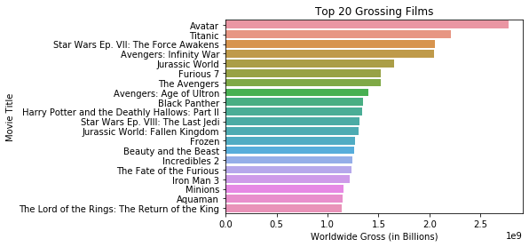
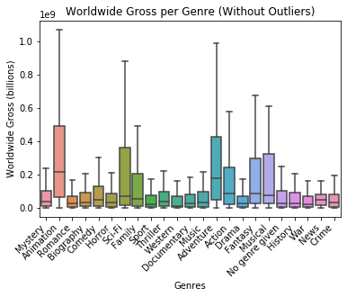
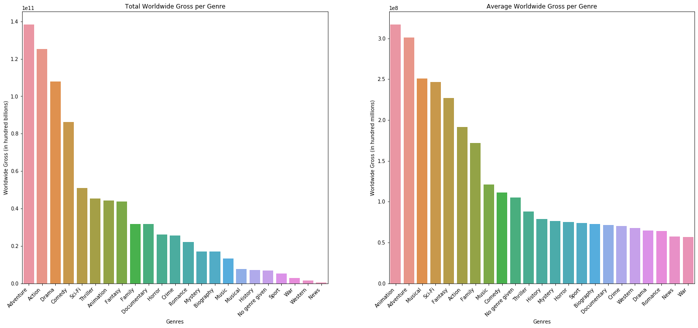
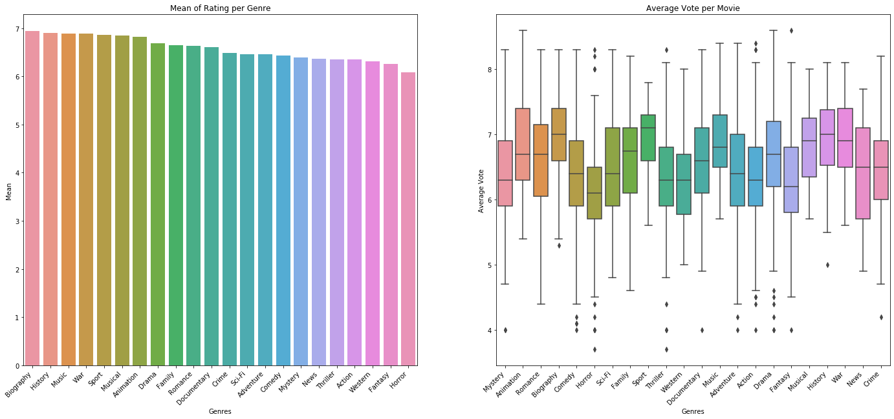
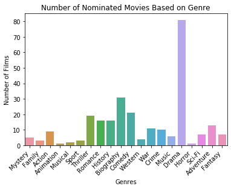
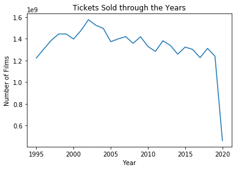

## Final Project Submission

Please fill out:
* Student name: Cristina Townsend
* Student pace: part time 
* Scheduled project review date/time: Saturday 06/13/2020 at 4:00 pm
* Instructor name: James Irving
* Blog post URL: https://cristinamtown.github.io/


## Question I aim to answer:
1. Which types of movies have biggest box office gross profit?
2. Which types movies are most likely have people take Microsoft seriously as content creators?
4. Home release vs. theatrical release?


```python
import pandas as pd
import numpy as np
import matplotlib.pyplot as plt
%matplotlib inline
import seaborn as sns
```

#### Inspecting Given BoxOffice Mojo Gross


```python
df1 = pd.read_csv('zippedData/bom.movie_gross.csv.gz')
print(df1.shape)
df1.head()
```

    (3387, 5)


<div>
<style scoped>
    .dataframe tbody tr th:only-of-type {
        vertical-align: middle;
    }

    .dataframe tbody tr th {
        vertical-align: top;
    }

    .dataframe thead th {
        text-align: right;
    }
</style>
<table border="1" class="dataframe">
  <thead>
    <tr style="text-align: right;">
      <th></th>
      <th>title</th>
      <th>studio</th>
      <th>domestic_gross</th>
      <th>foreign_gross</th>
      <th>year</th>
    </tr>
  </thead>
  <tbody>
    <tr>
      <td>0</td>
      <td>Toy Story 3</td>
      <td>BV</td>
      <td>415000000.0</td>
      <td>652000000</td>
      <td>2010</td>
    </tr>
    <tr>
      <td>1</td>
      <td>Alice in Wonderland (2010)</td>
      <td>BV</td>
      <td>334200000.0</td>
      <td>691300000</td>
      <td>2010</td>
    </tr>
    <tr>
      <td>2</td>
      <td>Harry Potter and the Deathly Hallows Part 1</td>
      <td>WB</td>
      <td>296000000.0</td>
      <td>664300000</td>
      <td>2010</td>
    </tr>
    <tr>
      <td>3</td>
      <td>Inception</td>
      <td>WB</td>
      <td>292600000.0</td>
      <td>535700000</td>
      <td>2010</td>
    </tr>
    <tr>
      <td>4</td>
      <td>Shrek Forever After</td>
      <td>P/DW</td>
      <td>238700000.0</td>
      <td>513900000</td>
      <td>2010</td>
    </tr>
  </tbody>
</table>
</div>


```python
df1.info()
```

    <class 'pandas.core.frame.DataFrame'>
    RangeIndex: 3387 entries, 0 to 3386
    Data columns (total 5 columns):
    title             3387 non-null object
    studio            3382 non-null object
    domestic_gross    3359 non-null float64
    foreign_gross     2037 non-null object
    year              3387 non-null int64
    dtypes: float64(1), int64(1), object(3)
    memory usage: 132.4+ KB


#### Inspecting Given IMDb Data


```python
df2 = pd.read_csv('zippedData/imdb.name.basics.csv.gz')
print(df2.shape)
df2.head()
```

    (606648, 6)


<div>
<style scoped>
    .dataframe tbody tr th:only-of-type {
        vertical-align: middle;
    }

    .dataframe tbody tr th {
        vertical-align: top;
    }

    .dataframe thead th {
        text-align: right;
    }
</style>
<table border="1" class="dataframe">
  <thead>
    <tr style="text-align: right;">
      <th></th>
      <th>nconst</th>
      <th>primary_name</th>
      <th>birth_year</th>
      <th>death_year</th>
      <th>primary_profession</th>
      <th>known_for_titles</th>
    </tr>
  </thead>
  <tbody>
    <tr>
      <td>0</td>
      <td>nm0061671</td>
      <td>Mary Ellen Bauder</td>
      <td>NaN</td>
      <td>NaN</td>
      <td>miscellaneous,production_manager,producer</td>
      <td>tt0837562,tt2398241,tt0844471,tt0118553</td>
    </tr>
    <tr>
      <td>1</td>
      <td>nm0061865</td>
      <td>Joseph Bauer</td>
      <td>NaN</td>
      <td>NaN</td>
      <td>composer,music_department,sound_department</td>
      <td>tt0896534,tt6791238,tt0287072,tt1682940</td>
    </tr>
    <tr>
      <td>2</td>
      <td>nm0062070</td>
      <td>Bruce Baum</td>
      <td>NaN</td>
      <td>NaN</td>
      <td>miscellaneous,actor,writer</td>
      <td>tt1470654,tt0363631,tt0104030,tt0102898</td>
    </tr>
    <tr>
      <td>3</td>
      <td>nm0062195</td>
      <td>Axel Baumann</td>
      <td>NaN</td>
      <td>NaN</td>
      <td>camera_department,cinematographer,art_department</td>
      <td>tt0114371,tt2004304,tt1618448,tt1224387</td>
    </tr>
    <tr>
      <td>4</td>
      <td>nm0062798</td>
      <td>Pete Baxter</td>
      <td>NaN</td>
      <td>NaN</td>
      <td>production_designer,art_department,set_decorator</td>
      <td>tt0452644,tt0452692,tt3458030,tt2178256</td>
    </tr>
  </tbody>
</table>
</div>


```python
df2.info()
```

    <class 'pandas.core.frame.DataFrame'>
    RangeIndex: 606648 entries, 0 to 606647
    Data columns (total 6 columns):
    nconst                606648 non-null object
    primary_name          606648 non-null object
    birth_year            82736 non-null float64
    death_year            6783 non-null float64
    primary_profession    555308 non-null object
    known_for_titles      576444 non-null object
    dtypes: float64(2), object(4)
    memory usage: 27.8+ MB


```python
df3 = pd.read_csv('zippedData/imdb.title.akas.csv.gz')
print(df3.shape)
df3.head()
```

    (331703, 8)


<div>
<style scoped>
    .dataframe tbody tr th:only-of-type {
        vertical-align: middle;
    }

    .dataframe tbody tr th {
        vertical-align: top;
    }

    .dataframe thead th {
        text-align: right;
    }
</style>
<table border="1" class="dataframe">
  <thead>
    <tr style="text-align: right;">
      <th></th>
      <th>title_id</th>
      <th>ordering</th>
      <th>title</th>
      <th>region</th>
      <th>language</th>
      <th>types</th>
      <th>attributes</th>
      <th>is_original_title</th>
    </tr>
  </thead>
  <tbody>
    <tr>
      <td>0</td>
      <td>tt0369610</td>
      <td>10</td>
      <td>Джурасик свят</td>
      <td>BG</td>
      <td>bg</td>
      <td>NaN</td>
      <td>NaN</td>
      <td>0.0</td>
    </tr>
    <tr>
      <td>1</td>
      <td>tt0369610</td>
      <td>11</td>
      <td>Jurashikku warudo</td>
      <td>JP</td>
      <td>NaN</td>
      <td>imdbDisplay</td>
      <td>NaN</td>
      <td>0.0</td>
    </tr>
    <tr>
      <td>2</td>
      <td>tt0369610</td>
      <td>12</td>
      <td>Jurassic World: O Mundo dos Dinossauros</td>
      <td>BR</td>
      <td>NaN</td>
      <td>imdbDisplay</td>
      <td>NaN</td>
      <td>0.0</td>
    </tr>
    <tr>
      <td>3</td>
      <td>tt0369610</td>
      <td>13</td>
      <td>O Mundo dos Dinossauros</td>
      <td>BR</td>
      <td>NaN</td>
      <td>NaN</td>
      <td>short title</td>
      <td>0.0</td>
    </tr>
    <tr>
      <td>4</td>
      <td>tt0369610</td>
      <td>14</td>
      <td>Jurassic World</td>
      <td>FR</td>
      <td>NaN</td>
      <td>imdbDisplay</td>
      <td>NaN</td>
      <td>0.0</td>
    </tr>
  </tbody>
</table>
</div>


```python
df3.info()
```

    <class 'pandas.core.frame.DataFrame'>
    RangeIndex: 331703 entries, 0 to 331702
    Data columns (total 8 columns):
    title_id             331703 non-null object
    ordering             331703 non-null int64
    title                331703 non-null object
    region               278410 non-null object
    language             41715 non-null object
    types                168447 non-null object
    attributes           14925 non-null object
    is_original_title    331678 non-null float64
    dtypes: float64(1), int64(1), object(6)
    memory usage: 20.2+ MB


```python
df5 = pd.read_csv('zippedData/imdb.title.basics.csv.gz')
print(df5.shape)
df5.head()
```

    (146144, 6)


<div>
<style scoped>
    .dataframe tbody tr th:only-of-type {
        vertical-align: middle;
    }

    .dataframe tbody tr th {
        vertical-align: top;
    }

    .dataframe thead th {
        text-align: right;
    }
</style>
<table border="1" class="dataframe">
  <thead>
    <tr style="text-align: right;">
      <th></th>
      <th>tconst</th>
      <th>primary_title</th>
      <th>original_title</th>
      <th>start_year</th>
      <th>runtime_minutes</th>
      <th>genres</th>
    </tr>
  </thead>
  <tbody>
    <tr>
      <td>0</td>
      <td>tt0063540</td>
      <td>Sunghursh</td>
      <td>Sunghursh</td>
      <td>2013</td>
      <td>175.0</td>
      <td>Action,Crime,Drama</td>
    </tr>
    <tr>
      <td>1</td>
      <td>tt0066787</td>
      <td>One Day Before the Rainy Season</td>
      <td>Ashad Ka Ek Din</td>
      <td>2019</td>
      <td>114.0</td>
      <td>Biography,Drama</td>
    </tr>
    <tr>
      <td>2</td>
      <td>tt0069049</td>
      <td>The Other Side of the Wind</td>
      <td>The Other Side of the Wind</td>
      <td>2018</td>
      <td>122.0</td>
      <td>Drama</td>
    </tr>
    <tr>
      <td>3</td>
      <td>tt0069204</td>
      <td>Sabse Bada Sukh</td>
      <td>Sabse Bada Sukh</td>
      <td>2018</td>
      <td>NaN</td>
      <td>Comedy,Drama</td>
    </tr>
    <tr>
      <td>4</td>
      <td>tt0100275</td>
      <td>The Wandering Soap Opera</td>
      <td>La Telenovela Errante</td>
      <td>2017</td>
      <td>80.0</td>
      <td>Comedy,Drama,Fantasy</td>
    </tr>
  </tbody>
</table>
</div>


```python
df5.info()
```

    <class 'pandas.core.frame.DataFrame'>
    RangeIndex: 146144 entries, 0 to 146143
    Data columns (total 6 columns):
    tconst             146144 non-null object
    primary_title      146144 non-null object
    original_title     146123 non-null object
    start_year         146144 non-null int64
    runtime_minutes    114405 non-null float64
    genres             140736 non-null object
    dtypes: float64(1), int64(1), object(4)
    memory usage: 6.7+ MB


```python
df6 = pd.read_csv('zippedData/imdb.title.crew.csv.gz')
print(df6.shape)
df6.head()
```

    (146144, 3)


<div>
<style scoped>
    .dataframe tbody tr th:only-of-type {
        vertical-align: middle;
    }

    .dataframe tbody tr th {
        vertical-align: top;
    }

    .dataframe thead th {
        text-align: right;
    }
</style>
<table border="1" class="dataframe">
  <thead>
    <tr style="text-align: right;">
      <th></th>
      <th>tconst</th>
      <th>directors</th>
      <th>writers</th>
    </tr>
  </thead>
  <tbody>
    <tr>
      <td>0</td>
      <td>tt0285252</td>
      <td>nm0899854</td>
      <td>nm0899854</td>
    </tr>
    <tr>
      <td>1</td>
      <td>tt0438973</td>
      <td>NaN</td>
      <td>nm0175726,nm1802864</td>
    </tr>
    <tr>
      <td>2</td>
      <td>tt0462036</td>
      <td>nm1940585</td>
      <td>nm1940585</td>
    </tr>
    <tr>
      <td>3</td>
      <td>tt0835418</td>
      <td>nm0151540</td>
      <td>nm0310087,nm0841532</td>
    </tr>
    <tr>
      <td>4</td>
      <td>tt0878654</td>
      <td>nm0089502,nm2291498,nm2292011</td>
      <td>nm0284943</td>
    </tr>
  </tbody>
</table>
</div>


```python
df6.info()
```

    <class 'pandas.core.frame.DataFrame'>
    RangeIndex: 146144 entries, 0 to 146143
    Data columns (total 3 columns):
    tconst       146144 non-null object
    directors    140417 non-null object
    writers      110261 non-null object
    dtypes: object(3)
    memory usage: 3.3+ MB


```python
df7 = pd.read_csv('zippedData/imdb.title.ratings.csv.gz')
print(df7.shape)
df7.head()
```

    (73856, 3)


<div>
<style scoped>
    .dataframe tbody tr th:only-of-type {
        vertical-align: middle;
    }

    .dataframe tbody tr th {
        vertical-align: top;
    }

    .dataframe thead th {
        text-align: right;
    }
</style>
<table border="1" class="dataframe">
  <thead>
    <tr style="text-align: right;">
      <th></th>
      <th>tconst</th>
      <th>averagerating</th>
      <th>numvotes</th>
    </tr>
  </thead>
  <tbody>
    <tr>
      <td>0</td>
      <td>tt10356526</td>
      <td>8.3</td>
      <td>31</td>
    </tr>
    <tr>
      <td>1</td>
      <td>tt10384606</td>
      <td>8.9</td>
      <td>559</td>
    </tr>
    <tr>
      <td>2</td>
      <td>tt1042974</td>
      <td>6.4</td>
      <td>20</td>
    </tr>
    <tr>
      <td>3</td>
      <td>tt1043726</td>
      <td>4.2</td>
      <td>50352</td>
    </tr>
    <tr>
      <td>4</td>
      <td>tt1060240</td>
      <td>6.5</td>
      <td>21</td>
    </tr>
  </tbody>
</table>
</div>


```python
df7.info()
```

    <class 'pandas.core.frame.DataFrame'>
    RangeIndex: 73856 entries, 0 to 73855
    Data columns (total 3 columns):
    tconst           73856 non-null object
    averagerating    73856 non-null float64
    numvotes         73856 non-null int64
    dtypes: float64(1), int64(1), object(1)
    memory usage: 1.7+ MB


#### Inspecting gather IMDb Award data


```python
df12 = pd.read_csv('zippedData/Oscar Nominations (2010-2019).csv', encoding='latin-1')
df12.head()
```


<div>
<style scoped>
    .dataframe tbody tr th:only-of-type {
        vertical-align: middle;
    }

    .dataframe tbody tr th {
        vertical-align: top;
    }

    .dataframe thead th {
        text-align: right;
    }
</style>
<table border="1" class="dataframe">
  <thead>
    <tr style="text-align: right;">
      <th></th>
      <th>Position</th>
      <th>Const</th>
      <th>Created</th>
      <th>Modified</th>
      <th>Description</th>
      <th>Title</th>
      <th>URL</th>
      <th>Title Type</th>
      <th>IMDb Rating</th>
      <th>Runtime (mins)</th>
      <th>Year</th>
      <th>Genres</th>
      <th>Num Votes</th>
      <th>Release Date</th>
      <th>Directors</th>
    </tr>
  </thead>
  <tbody>
    <tr>
      <td>0</td>
      <td>1</td>
      <td>tt5052448</td>
      <td>2018-08-15</td>
      <td>2018-08-15</td>
      <td>NaN</td>
      <td>Get Out</td>
      <td>https://www.imdb.com/title/tt5052448/</td>
      <td>movie</td>
      <td>7.7</td>
      <td>104</td>
      <td>2017</td>
      <td>Horror, Mystery, Thriller</td>
      <td>461375</td>
      <td>2017-01-23</td>
      <td>Jordan Peele</td>
    </tr>
    <tr>
      <td>1</td>
      <td>2</td>
      <td>tt4925292</td>
      <td>2018-08-15</td>
      <td>2018-08-15</td>
      <td>NaN</td>
      <td>Lady Bird</td>
      <td>https://www.imdb.com/title/tt4925292/</td>
      <td>movie</td>
      <td>7.4</td>
      <td>94</td>
      <td>2017</td>
      <td>Comedy, Drama</td>
      <td>219570</td>
      <td>2017-09-01</td>
      <td>Greta Gerwig</td>
    </tr>
    <tr>
      <td>2</td>
      <td>3</td>
      <td>tt5726616</td>
      <td>2018-08-15</td>
      <td>2018-08-15</td>
      <td>NaN</td>
      <td>Call Me by Your Name</td>
      <td>https://www.imdb.com/title/tt5726616/</td>
      <td>movie</td>
      <td>7.9</td>
      <td>132</td>
      <td>2017</td>
      <td>Drama, Romance</td>
      <td>192466</td>
      <td>2017-01-22</td>
      <td>Luca Guadagnino</td>
    </tr>
    <tr>
      <td>3</td>
      <td>4</td>
      <td>tt5013056</td>
      <td>2018-08-15</td>
      <td>2018-08-15</td>
      <td>NaN</td>
      <td>Dunkirk</td>
      <td>https://www.imdb.com/title/tt5013056/</td>
      <td>movie</td>
      <td>7.9</td>
      <td>106</td>
      <td>2017</td>
      <td>Action, Drama, History, Thriller, War</td>
      <td>518990</td>
      <td>2017-07-13</td>
      <td>Christopher Nolan</td>
    </tr>
    <tr>
      <td>4</td>
      <td>5</td>
      <td>tt5027774</td>
      <td>2018-08-15</td>
      <td>2018-08-15</td>
      <td>NaN</td>
      <td>Three Billboards Outside Ebbing, Missouri</td>
      <td>https://www.imdb.com/title/tt5027774/</td>
      <td>movie</td>
      <td>8.2</td>
      <td>115</td>
      <td>2017</td>
      <td>Comedy, Crime, Drama</td>
      <td>400525</td>
      <td>2017-09-04</td>
      <td>Martin McDonagh</td>
    </tr>
  </tbody>
</table>
</div>


```python
df12.info()
```

    <class 'pandas.core.frame.DataFrame'>
    RangeIndex: 516 entries, 0 to 515
    Data columns (total 15 columns):
    Position          516 non-null int64
    Const             516 non-null object
    Created           516 non-null object
    Modified          516 non-null object
    Description       0 non-null float64
    Title             516 non-null object
    URL               516 non-null object
    Title Type        516 non-null object
    IMDb Rating       516 non-null float64
    Runtime (mins)    516 non-null int64
    Year              516 non-null int64
    Genres            516 non-null object
    Num Votes         516 non-null int64
    Release Date      515 non-null object
    Directors         516 non-null object
    dtypes: float64(2), int64(4), object(9)
    memory usage: 60.6+ KB


```python
df13 = pd.read_csv('zippedData/Best Picture Nominees 2000-2009.csv', encoding='latin-1')
df13.head()
```


<div>
<style scoped>
    .dataframe tbody tr th:only-of-type {
        vertical-align: middle;
    }

    .dataframe tbody tr th {
        vertical-align: top;
    }

    .dataframe thead th {
        text-align: right;
    }
</style>
<table border="1" class="dataframe">
  <thead>
    <tr style="text-align: right;">
      <th></th>
      <th>Position</th>
      <th>Const</th>
      <th>Created</th>
      <th>Modified</th>
      <th>Description</th>
      <th>Title</th>
      <th>URL</th>
      <th>Title Type</th>
      <th>IMDb Rating</th>
      <th>Runtime (mins)</th>
      <th>Year</th>
      <th>Genres</th>
      <th>Num Votes</th>
      <th>Release Date</th>
      <th>Directors</th>
    </tr>
  </thead>
  <tbody>
    <tr>
      <td>0</td>
      <td>1</td>
      <td>tt0499549</td>
      <td>2011-05-03</td>
      <td>2011-05-03</td>
      <td>[b][purple]Golden Globe BP Winner - 2009[/purp...</td>
      <td>Avatar</td>
      <td>https://www.imdb.com/title/tt0499549/</td>
      <td>movie</td>
      <td>7.8</td>
      <td>162</td>
      <td>2009</td>
      <td>Action, Adventure, Fantasy, Sci-Fi</td>
      <td>1093171</td>
      <td>2009-12-10</td>
      <td>James Cameron</td>
    </tr>
    <tr>
      <td>1</td>
      <td>2</td>
      <td>tt0887912</td>
      <td>2011-05-03</td>
      <td>2011-05-03</td>
      <td>[b][blue]Academy Award BP Winner - 2009[/blue]...</td>
      <td>The Hurt Locker</td>
      <td>https://www.imdb.com/title/tt0887912/</td>
      <td>movie</td>
      <td>7.6</td>
      <td>131</td>
      <td>2008</td>
      <td>Drama, Thriller, War</td>
      <td>410397</td>
      <td>2008-09-04</td>
      <td>Kathryn Bigelow</td>
    </tr>
    <tr>
      <td>2</td>
      <td>3</td>
      <td>tt0878804</td>
      <td>2011-05-03</td>
      <td>2011-05-03</td>
      <td>[blue]Academy Award BP Nominee - 2009[/blue]</td>
      <td>The Blind Side</td>
      <td>https://www.imdb.com/title/tt0878804/</td>
      <td>movie</td>
      <td>7.6</td>
      <td>129</td>
      <td>2009</td>
      <td>Biography, Drama, Sport</td>
      <td>282332</td>
      <td>2009-11-17</td>
      <td>John Lee Hancock</td>
    </tr>
    <tr>
      <td>3</td>
      <td>4</td>
      <td>tt1136608</td>
      <td>2011-05-03</td>
      <td>2011-05-03</td>
      <td>[blue]Academy Award BP Nominee - 2009[/blue]</td>
      <td>District 9</td>
      <td>https://www.imdb.com/title/tt1136608/</td>
      <td>movie</td>
      <td>7.9</td>
      <td>112</td>
      <td>2009</td>
      <td>Action, Sci-Fi, Thriller</td>
      <td>626066</td>
      <td>2009-08-13</td>
      <td>Neill Blomkamp</td>
    </tr>
    <tr>
      <td>4</td>
      <td>5</td>
      <td>tt1174732</td>
      <td>2011-05-03</td>
      <td>2011-05-03</td>
      <td>[blue]Academy Award BP Nominee - 2009[/blue]</td>
      <td>An Education</td>
      <td>https://www.imdb.com/title/tt1174732/</td>
      <td>movie</td>
      <td>7.3</td>
      <td>100</td>
      <td>2009</td>
      <td>Drama</td>
      <td>126083</td>
      <td>2009-01-18</td>
      <td>Lone Scherfig</td>
    </tr>
  </tbody>
</table>
</div>


```python
df14 = pd.read_csv('zippedData/Best Picture Nominees (2010-2019).csv', encoding='latin-1')
df14.head()
```


<div>
<style scoped>
    .dataframe tbody tr th:only-of-type {
        vertical-align: middle;
    }

    .dataframe tbody tr th {
        vertical-align: top;
    }

    .dataframe thead th {
        text-align: right;
    }
</style>
<table border="1" class="dataframe">
  <thead>
    <tr style="text-align: right;">
      <th></th>
      <th>Position</th>
      <th>Const</th>
      <th>Created</th>
      <th>Modified</th>
      <th>Description</th>
      <th>Title</th>
      <th>URL</th>
      <th>Title Type</th>
      <th>IMDb Rating</th>
      <th>Runtime (mins)</th>
      <th>Year</th>
      <th>Genres</th>
      <th>Num Votes</th>
      <th>Release Date</th>
      <th>Directors</th>
    </tr>
  </thead>
  <tbody>
    <tr>
      <td>0</td>
      <td>1</td>
      <td>tt1542344</td>
      <td>2013-12-13</td>
      <td>2013-12-13</td>
      <td>NaN</td>
      <td>127 Hours</td>
      <td>https://www.imdb.com/title/tt1542344/</td>
      <td>movie</td>
      <td>7.6</td>
      <td>94</td>
      <td>2010</td>
      <td>Biography, Drama</td>
      <td>339125</td>
      <td>2010-09-04</td>
      <td>Danny Boyle</td>
    </tr>
    <tr>
      <td>1</td>
      <td>2</td>
      <td>tt0947798</td>
      <td>2013-12-13</td>
      <td>2013-12-13</td>
      <td>NaN</td>
      <td>Black Swan</td>
      <td>https://www.imdb.com/title/tt0947798/</td>
      <td>movie</td>
      <td>8.0</td>
      <td>108</td>
      <td>2010</td>
      <td>Drama, Thriller</td>
      <td>680069</td>
      <td>2010-09-01</td>
      <td>Darren Aronofsky</td>
    </tr>
    <tr>
      <td>2</td>
      <td>3</td>
      <td>tt0964517</td>
      <td>2013-12-13</td>
      <td>2013-12-13</td>
      <td>NaN</td>
      <td>The Fighter</td>
      <td>https://www.imdb.com/title/tt0964517/</td>
      <td>movie</td>
      <td>7.8</td>
      <td>116</td>
      <td>2010</td>
      <td>Biography, Drama, Sport</td>
      <td>330883</td>
      <td>2010-12-06</td>
      <td>David O. Russell</td>
    </tr>
    <tr>
      <td>3</td>
      <td>4</td>
      <td>tt1375666</td>
      <td>2013-12-13</td>
      <td>2013-12-13</td>
      <td>NaN</td>
      <td>Inception</td>
      <td>https://www.imdb.com/title/tt1375666/</td>
      <td>movie</td>
      <td>8.8</td>
      <td>148</td>
      <td>2010</td>
      <td>Action, Adventure, Sci-Fi, Thriller</td>
      <td>1969502</td>
      <td>2010-07-08</td>
      <td>Christopher Nolan</td>
    </tr>
    <tr>
      <td>4</td>
      <td>5</td>
      <td>tt0842926</td>
      <td>2013-12-13</td>
      <td>2013-12-13</td>
      <td>NaN</td>
      <td>The Kids Are All Right</td>
      <td>https://www.imdb.com/title/tt0842926/</td>
      <td>movie</td>
      <td>7.0</td>
      <td>106</td>
      <td>2010</td>
      <td>Comedy, Drama, Romance</td>
      <td>123591</td>
      <td>2010-01-25</td>
      <td>Lisa Cholodenko</td>
    </tr>
  </tbody>
</table>
</div>


#### Inspecting Given Rotten Tomatoes Data


```python
df8 = pd.read_csv('zippedData/rt.movie_info.tsv.gz', sep='\t')
print(df8.shape)
df8.head()
```

    (1560, 12)


<div>
<style scoped>
    .dataframe tbody tr th:only-of-type {
        vertical-align: middle;
    }

    .dataframe tbody tr th {
        vertical-align: top;
    }

    .dataframe thead th {
        text-align: right;
    }
</style>
<table border="1" class="dataframe">
  <thead>
    <tr style="text-align: right;">
      <th></th>
      <th>id</th>
      <th>synopsis</th>
      <th>rating</th>
      <th>genre</th>
      <th>director</th>
      <th>writer</th>
      <th>theater_date</th>
      <th>dvd_date</th>
      <th>currency</th>
      <th>box_office</th>
      <th>runtime</th>
      <th>studio</th>
    </tr>
  </thead>
  <tbody>
    <tr>
      <td>0</td>
      <td>1</td>
      <td>This gritty, fast-paced, and innovative police...</td>
      <td>R</td>
      <td>Action and Adventure|Classics|Drama</td>
      <td>William Friedkin</td>
      <td>Ernest Tidyman</td>
      <td>Oct 9, 1971</td>
      <td>Sep 25, 2001</td>
      <td>NaN</td>
      <td>NaN</td>
      <td>104 minutes</td>
      <td>NaN</td>
    </tr>
    <tr>
      <td>1</td>
      <td>3</td>
      <td>New York City, not-too-distant-future: Eric Pa...</td>
      <td>R</td>
      <td>Drama|Science Fiction and Fantasy</td>
      <td>David Cronenberg</td>
      <td>David Cronenberg|Don DeLillo</td>
      <td>Aug 17, 2012</td>
      <td>Jan 1, 2013</td>
      <td>$</td>
      <td>600,000</td>
      <td>108 minutes</td>
      <td>Entertainment One</td>
    </tr>
    <tr>
      <td>2</td>
      <td>5</td>
      <td>Illeana Douglas delivers a superb performance ...</td>
      <td>R</td>
      <td>Drama|Musical and Performing Arts</td>
      <td>Allison Anders</td>
      <td>Allison Anders</td>
      <td>Sep 13, 1996</td>
      <td>Apr 18, 2000</td>
      <td>NaN</td>
      <td>NaN</td>
      <td>116 minutes</td>
      <td>NaN</td>
    </tr>
    <tr>
      <td>3</td>
      <td>6</td>
      <td>Michael Douglas runs afoul of a treacherous su...</td>
      <td>R</td>
      <td>Drama|Mystery and Suspense</td>
      <td>Barry Levinson</td>
      <td>Paul Attanasio|Michael Crichton</td>
      <td>Dec 9, 1994</td>
      <td>Aug 27, 1997</td>
      <td>NaN</td>
      <td>NaN</td>
      <td>128 minutes</td>
      <td>NaN</td>
    </tr>
    <tr>
      <td>4</td>
      <td>7</td>
      <td>NaN</td>
      <td>NR</td>
      <td>Drama|Romance</td>
      <td>Rodney Bennett</td>
      <td>Giles Cooper</td>
      <td>NaN</td>
      <td>NaN</td>
      <td>NaN</td>
      <td>NaN</td>
      <td>200 minutes</td>
      <td>NaN</td>
    </tr>
  </tbody>
</table>
</div>


```python
df8.info()
```

    <class 'pandas.core.frame.DataFrame'>
    RangeIndex: 1560 entries, 0 to 1559
    Data columns (total 12 columns):
    id              1560 non-null int64
    synopsis        1498 non-null object
    rating          1557 non-null object
    genre           1552 non-null object
    director        1361 non-null object
    writer          1111 non-null object
    theater_date    1201 non-null object
    dvd_date        1201 non-null object
    currency        340 non-null object
    box_office      340 non-null object
    runtime         1530 non-null object
    studio          494 non-null object
    dtypes: int64(1), object(11)
    memory usage: 146.4+ KB


```python
df9 = pd.read_csv('zippedData/rt.reviews.tsv.gz', sep='\t', encoding='latin-1')
print(df9.shape)
df9.head()
```

    (54432, 8)


<div>
<style scoped>
    .dataframe tbody tr th:only-of-type {
        vertical-align: middle;
    }

    .dataframe tbody tr th {
        vertical-align: top;
    }

    .dataframe thead th {
        text-align: right;
    }
</style>
<table border="1" class="dataframe">
  <thead>
    <tr style="text-align: right;">
      <th></th>
      <th>id</th>
      <th>review</th>
      <th>rating</th>
      <th>fresh</th>
      <th>critic</th>
      <th>top_critic</th>
      <th>publisher</th>
      <th>date</th>
    </tr>
  </thead>
  <tbody>
    <tr>
      <td>0</td>
      <td>3</td>
      <td>A distinctly gallows take on contemporary fina...</td>
      <td>3/5</td>
      <td>fresh</td>
      <td>PJ Nabarro</td>
      <td>0</td>
      <td>Patrick Nabarro</td>
      <td>November 10, 2018</td>
    </tr>
    <tr>
      <td>1</td>
      <td>3</td>
      <td>It's an allegory in search of a meaning that n...</td>
      <td>NaN</td>
      <td>rotten</td>
      <td>Annalee Newitz</td>
      <td>0</td>
      <td>io9.com</td>
      <td>May 23, 2018</td>
    </tr>
    <tr>
      <td>2</td>
      <td>3</td>
      <td>... life lived in a bubble in financial dealin...</td>
      <td>NaN</td>
      <td>fresh</td>
      <td>Sean Axmaker</td>
      <td>0</td>
      <td>Stream on Demand</td>
      <td>January 4, 2018</td>
    </tr>
    <tr>
      <td>3</td>
      <td>3</td>
      <td>Continuing along a line introduced in last yea...</td>
      <td>NaN</td>
      <td>fresh</td>
      <td>Daniel Kasman</td>
      <td>0</td>
      <td>MUBI</td>
      <td>November 16, 2017</td>
    </tr>
    <tr>
      <td>4</td>
      <td>3</td>
      <td>... a perverse twist on neorealism...</td>
      <td>NaN</td>
      <td>fresh</td>
      <td>NaN</td>
      <td>0</td>
      <td>Cinema Scope</td>
      <td>October 12, 2017</td>
    </tr>
  </tbody>
</table>
</div>


```python
df9.info()
```

    <class 'pandas.core.frame.DataFrame'>
    RangeIndex: 54432 entries, 0 to 54431
    Data columns (total 8 columns):
    id            54432 non-null int64
    review        48869 non-null object
    rating        40915 non-null object
    fresh         54432 non-null object
    critic        51710 non-null object
    top_critic    54432 non-null int64
    publisher     54123 non-null object
    date          54432 non-null object
    dtypes: int64(2), object(6)
    memory usage: 3.3+ MB


#### Inspecting Given TMDb Data


```python
df10 = pd.read_csv('zippedData/tmdb.movies.csv.gz', index_col=0)
print(df10.shape)
df10.head()
```

    (26517, 9)


<div>
<style scoped>
    .dataframe tbody tr th:only-of-type {
        vertical-align: middle;
    }

    .dataframe tbody tr th {
        vertical-align: top;
    }

    .dataframe thead th {
        text-align: right;
    }
</style>
<table border="1" class="dataframe">
  <thead>
    <tr style="text-align: right;">
      <th></th>
      <th>genre_ids</th>
      <th>id</th>
      <th>original_language</th>
      <th>original_title</th>
      <th>popularity</th>
      <th>release_date</th>
      <th>title</th>
      <th>vote_average</th>
      <th>vote_count</th>
    </tr>
  </thead>
  <tbody>
    <tr>
      <td>0</td>
      <td>[12, 14, 10751]</td>
      <td>12444</td>
      <td>en</td>
      <td>Harry Potter and the Deathly Hallows: Part 1</td>
      <td>33.533</td>
      <td>2010-11-19</td>
      <td>Harry Potter and the Deathly Hallows: Part 1</td>
      <td>7.7</td>
      <td>10788</td>
    </tr>
    <tr>
      <td>1</td>
      <td>[14, 12, 16, 10751]</td>
      <td>10191</td>
      <td>en</td>
      <td>How to Train Your Dragon</td>
      <td>28.734</td>
      <td>2010-03-26</td>
      <td>How to Train Your Dragon</td>
      <td>7.7</td>
      <td>7610</td>
    </tr>
    <tr>
      <td>2</td>
      <td>[12, 28, 878]</td>
      <td>10138</td>
      <td>en</td>
      <td>Iron Man 2</td>
      <td>28.515</td>
      <td>2010-05-07</td>
      <td>Iron Man 2</td>
      <td>6.8</td>
      <td>12368</td>
    </tr>
    <tr>
      <td>3</td>
      <td>[16, 35, 10751]</td>
      <td>862</td>
      <td>en</td>
      <td>Toy Story</td>
      <td>28.005</td>
      <td>1995-11-22</td>
      <td>Toy Story</td>
      <td>7.9</td>
      <td>10174</td>
    </tr>
    <tr>
      <td>4</td>
      <td>[28, 878, 12]</td>
      <td>27205</td>
      <td>en</td>
      <td>Inception</td>
      <td>27.920</td>
      <td>2010-07-16</td>
      <td>Inception</td>
      <td>8.3</td>
      <td>22186</td>
    </tr>
  </tbody>
</table>
</div>


```python
df10.info()
```

    <class 'pandas.core.frame.DataFrame'>
    Int64Index: 26517 entries, 0 to 26516
    Data columns (total 9 columns):
    genre_ids            26517 non-null object
    id                   26517 non-null int64
    original_language    26517 non-null object
    original_title       26517 non-null object
    popularity           26517 non-null float64
    release_date         26517 non-null object
    title                26517 non-null object
    vote_average         26517 non-null float64
    vote_count           26517 non-null int64
    dtypes: float64(2), int64(2), object(5)
    memory usage: 2.0+ MB


#### Inspecting Given The Numbers Data


```python
df11 = pd.read_csv('zippedData/tn.movie_budgets.csv.gz')
print(df11.shape)
df11.head()
```

    (5782, 6)


<div>
<style scoped>
    .dataframe tbody tr th:only-of-type {
        vertical-align: middle;
    }

    .dataframe tbody tr th {
        vertical-align: top;
    }

    .dataframe thead th {
        text-align: right;
    }
</style>
<table border="1" class="dataframe">
  <thead>
    <tr style="text-align: right;">
      <th></th>
      <th>id</th>
      <th>release_date</th>
      <th>movie</th>
      <th>production_budget</th>
      <th>domestic_gross</th>
      <th>worldwide_gross</th>
    </tr>
  </thead>
  <tbody>
    <tr>
      <td>0</td>
      <td>1</td>
      <td>Dec 18, 2009</td>
      <td>Avatar</td>
      <td>$425,000,000</td>
      <td>$760,507,625</td>
      <td>$2,776,345,279</td>
    </tr>
    <tr>
      <td>1</td>
      <td>2</td>
      <td>May 20, 2011</td>
      <td>Pirates of the Caribbean: On Stranger Tides</td>
      <td>$410,600,000</td>
      <td>$241,063,875</td>
      <td>$1,045,663,875</td>
    </tr>
    <tr>
      <td>2</td>
      <td>3</td>
      <td>Jun 7, 2019</td>
      <td>Dark Phoenix</td>
      <td>$350,000,000</td>
      <td>$42,762,350</td>
      <td>$149,762,350</td>
    </tr>
    <tr>
      <td>3</td>
      <td>4</td>
      <td>May 1, 2015</td>
      <td>Avengers: Age of Ultron</td>
      <td>$330,600,000</td>
      <td>$459,005,868</td>
      <td>$1,403,013,963</td>
    </tr>
    <tr>
      <td>4</td>
      <td>5</td>
      <td>Dec 15, 2017</td>
      <td>Star Wars Ep. VIII: The Last Jedi</td>
      <td>$317,000,000</td>
      <td>$620,181,382</td>
      <td>$1,316,721,747</td>
    </tr>
  </tbody>
</table>
</div>


```python
df11.info()
```

    <class 'pandas.core.frame.DataFrame'>
    RangeIndex: 5782 entries, 0 to 5781
    Data columns (total 6 columns):
    id                   5782 non-null int64
    release_date         5782 non-null object
    movie                5782 non-null object
    production_budget    5782 non-null object
    domestic_gross       5782 non-null object
    worldwide_gross      5782 non-null object
    dtypes: int64(1), object(5)
    memory usage: 271.2+ KB


### Which types/genres of movies have the biggest box office gross profit?


#### See highest grossing movies with no other data


```python
# Get box office data from the Numbers
df_tn = pd.read_csv('zippedData/tn.movie_budgets.csv.gz')
print(df_tn.shape)
df_tn.head()
```

    (5782, 6)


<div>
<style scoped>
    .dataframe tbody tr th:only-of-type {
        vertical-align: middle;
    }

    .dataframe tbody tr th {
        vertical-align: top;
    }

    .dataframe thead th {
        text-align: right;
    }
</style>
<table border="1" class="dataframe">
  <thead>
    <tr style="text-align: right;">
      <th></th>
      <th>id</th>
      <th>release_date</th>
      <th>movie</th>
      <th>production_budget</th>
      <th>domestic_gross</th>
      <th>worldwide_gross</th>
    </tr>
  </thead>
  <tbody>
    <tr>
      <td>0</td>
      <td>1</td>
      <td>Dec 18, 2009</td>
      <td>Avatar</td>
      <td>$425,000,000</td>
      <td>$760,507,625</td>
      <td>$2,776,345,279</td>
    </tr>
    <tr>
      <td>1</td>
      <td>2</td>
      <td>May 20, 2011</td>
      <td>Pirates of the Caribbean: On Stranger Tides</td>
      <td>$410,600,000</td>
      <td>$241,063,875</td>
      <td>$1,045,663,875</td>
    </tr>
    <tr>
      <td>2</td>
      <td>3</td>
      <td>Jun 7, 2019</td>
      <td>Dark Phoenix</td>
      <td>$350,000,000</td>
      <td>$42,762,350</td>
      <td>$149,762,350</td>
    </tr>
    <tr>
      <td>3</td>
      <td>4</td>
      <td>May 1, 2015</td>
      <td>Avengers: Age of Ultron</td>
      <td>$330,600,000</td>
      <td>$459,005,868</td>
      <td>$1,403,013,963</td>
    </tr>
    <tr>
      <td>4</td>
      <td>5</td>
      <td>Dec 15, 2017</td>
      <td>Star Wars Ep. VIII: The Last Jedi</td>
      <td>$317,000,000</td>
      <td>$620,181,382</td>
      <td>$1,316,721,747</td>
    </tr>
  </tbody>
</table>
</div>


```python
# Remove commas and $ from worldwide_gross so we can change type to float
df_tn['worldwide_gross'] = df_tn['worldwide_gross'].str.replace(',', '')
df_tn['worldwide_gross'] = df_tn['worldwide_gross'].str.replace('$', '')
df_tn['worldwide_gross'] = df_tn['worldwide_gross'].astype(float)
df_tn.info()
```

    <class 'pandas.core.frame.DataFrame'>
    RangeIndex: 5782 entries, 0 to 5781
    Data columns (total 6 columns):
    id                   5782 non-null int64
    release_date         5782 non-null object
    movie                5782 non-null object
    production_budget    5782 non-null object
    domestic_gross       5782 non-null object
    worldwide_gross      5782 non-null float64
    dtypes: float64(1), int64(1), object(4)
    memory usage: 271.2+ KB


```python
# Drop any film with worldwide_gross = 0, b/c it means wasn't released in theaters
df_tn = df_tn[df_tn.worldwide_gross != 0]

```


```python
#Sort by total gross
df_tn_sort = df_tn.sort_values(by=['worldwide_gross'], ascending=False)
df_tn_sort.head()
```


<div>
<style scoped>
    .dataframe tbody tr th:only-of-type {
        vertical-align: middle;
    }

    .dataframe tbody tr th {
        vertical-align: top;
    }

    .dataframe thead th {
        text-align: right;
    }
</style>
<table border="1" class="dataframe">
  <thead>
    <tr style="text-align: right;">
      <th></th>
      <th>id</th>
      <th>release_date</th>
      <th>movie</th>
      <th>production_budget</th>
      <th>domestic_gross</th>
      <th>worldwide_gross</th>
    </tr>
  </thead>
  <tbody>
    <tr>
      <td>0</td>
      <td>1</td>
      <td>Dec 18, 2009</td>
      <td>Avatar</td>
      <td>$425,000,000</td>
      <td>$760,507,625</td>
      <td>2.776345e+09</td>
    </tr>
    <tr>
      <td>42</td>
      <td>43</td>
      <td>Dec 19, 1997</td>
      <td>Titanic</td>
      <td>$200,000,000</td>
      <td>$659,363,944</td>
      <td>2.208208e+09</td>
    </tr>
    <tr>
      <td>5</td>
      <td>6</td>
      <td>Dec 18, 2015</td>
      <td>Star Wars Ep. VII: The Force Awakens</td>
      <td>$306,000,000</td>
      <td>$936,662,225</td>
      <td>2.053311e+09</td>
    </tr>
    <tr>
      <td>6</td>
      <td>7</td>
      <td>Apr 27, 2018</td>
      <td>Avengers: Infinity War</td>
      <td>$300,000,000</td>
      <td>$678,815,482</td>
      <td>2.048134e+09</td>
    </tr>
    <tr>
      <td>33</td>
      <td>34</td>
      <td>Jun 12, 2015</td>
      <td>Jurassic World</td>
      <td>$215,000,000</td>
      <td>$652,270,625</td>
      <td>1.648855e+09</td>
    </tr>
  </tbody>
</table>
</div>


```python
df_tn_sort.tail()
```


<div>
<style scoped>
    .dataframe tbody tr th:only-of-type {
        vertical-align: middle;
    }

    .dataframe tbody tr th {
        vertical-align: top;
    }

    .dataframe thead th {
        text-align: right;
    }
</style>
<table border="1" class="dataframe">
  <thead>
    <tr style="text-align: right;">
      <th></th>
      <th>id</th>
      <th>release_date</th>
      <th>movie</th>
      <th>production_budget</th>
      <th>domestic_gross</th>
      <th>worldwide_gross</th>
    </tr>
  </thead>
  <tbody>
    <tr>
      <td>5383</td>
      <td>84</td>
      <td>Dec 31, 2014</td>
      <td>Destiny</td>
      <td>$750,000</td>
      <td>$0</td>
      <td>450.0</td>
    </tr>
    <tr>
      <td>5518</td>
      <td>19</td>
      <td>Oct 13, 2005</td>
      <td>The Dark Hours</td>
      <td>$400,000</td>
      <td>$423</td>
      <td>423.0</td>
    </tr>
    <tr>
      <td>5770</td>
      <td>71</td>
      <td>Aug 14, 2008</td>
      <td>The Rise and Fall of Miss Thang</td>
      <td>$10,000</td>
      <td>$401</td>
      <td>401.0</td>
    </tr>
    <tr>
      <td>5335</td>
      <td>36</td>
      <td>Nov 21, 2014</td>
      <td>Food Chains</td>
      <td>$913,000</td>
      <td>$0</td>
      <td>176.0</td>
    </tr>
    <tr>
      <td>5302</td>
      <td>3</td>
      <td>Dec 11, 2015</td>
      <td>American Hero</td>
      <td>$1,000,000</td>
      <td>$0</td>
      <td>26.0</td>
    </tr>
  </tbody>
</table>
</div>


```python
# Graph 20 highest grossing movies
df_top20 = df_tn_sort[:20]
df_top20
```


<div>
<style scoped>
    .dataframe tbody tr th:only-of-type {
        vertical-align: middle;
    }

    .dataframe tbody tr th {
        vertical-align: top;
    }

    .dataframe thead th {
        text-align: right;
    }
</style>
<table border="1" class="dataframe">
  <thead>
    <tr style="text-align: right;">
      <th></th>
      <th>id</th>
      <th>release_date</th>
      <th>movie</th>
      <th>production_budget</th>
      <th>domestic_gross</th>
      <th>worldwide_gross</th>
    </tr>
  </thead>
  <tbody>
    <tr>
      <td>0</td>
      <td>1</td>
      <td>Dec 18, 2009</td>
      <td>Avatar</td>
      <td>$425,000,000</td>
      <td>$760,507,625</td>
      <td>2.776345e+09</td>
    </tr>
    <tr>
      <td>42</td>
      <td>43</td>
      <td>Dec 19, 1997</td>
      <td>Titanic</td>
      <td>$200,000,000</td>
      <td>$659,363,944</td>
      <td>2.208208e+09</td>
    </tr>
    <tr>
      <td>5</td>
      <td>6</td>
      <td>Dec 18, 2015</td>
      <td>Star Wars Ep. VII: The Force Awakens</td>
      <td>$306,000,000</td>
      <td>$936,662,225</td>
      <td>2.053311e+09</td>
    </tr>
    <tr>
      <td>6</td>
      <td>7</td>
      <td>Apr 27, 2018</td>
      <td>Avengers: Infinity War</td>
      <td>$300,000,000</td>
      <td>$678,815,482</td>
      <td>2.048134e+09</td>
    </tr>
    <tr>
      <td>33</td>
      <td>34</td>
      <td>Jun 12, 2015</td>
      <td>Jurassic World</td>
      <td>$215,000,000</td>
      <td>$652,270,625</td>
      <td>1.648855e+09</td>
    </tr>
    <tr>
      <td>66</td>
      <td>67</td>
      <td>Apr 3, 2015</td>
      <td>Furious 7</td>
      <td>$190,000,000</td>
      <td>$353,007,020</td>
      <td>1.518723e+09</td>
    </tr>
    <tr>
      <td>26</td>
      <td>27</td>
      <td>May 4, 2012</td>
      <td>The Avengers</td>
      <td>$225,000,000</td>
      <td>$623,279,547</td>
      <td>1.517936e+09</td>
    </tr>
    <tr>
      <td>3</td>
      <td>4</td>
      <td>May 1, 2015</td>
      <td>Avengers: Age of Ultron</td>
      <td>$330,600,000</td>
      <td>$459,005,868</td>
      <td>1.403014e+09</td>
    </tr>
    <tr>
      <td>41</td>
      <td>42</td>
      <td>Feb 16, 2018</td>
      <td>Black Panther</td>
      <td>$200,000,000</td>
      <td>$700,059,566</td>
      <td>1.348258e+09</td>
    </tr>
    <tr>
      <td>260</td>
      <td>61</td>
      <td>Jul 15, 2011</td>
      <td>Harry Potter and the Deathly Hallows: Part II</td>
      <td>$125,000,000</td>
      <td>$381,193,157</td>
      <td>1.341693e+09</td>
    </tr>
    <tr>
      <td>4</td>
      <td>5</td>
      <td>Dec 15, 2017</td>
      <td>Star Wars Ep. VIII: The Last Jedi</td>
      <td>$317,000,000</td>
      <td>$620,181,382</td>
      <td>1.316722e+09</td>
    </tr>
    <tr>
      <td>112</td>
      <td>13</td>
      <td>Jun 22, 2018</td>
      <td>Jurassic World: Fallen Kingdom</td>
      <td>$170,000,000</td>
      <td>$417,719,760</td>
      <td>1.305773e+09</td>
    </tr>
    <tr>
      <td>155</td>
      <td>56</td>
      <td>Nov 22, 2013</td>
      <td>Frozen</td>
      <td>$150,000,000</td>
      <td>$400,738,009</td>
      <td>1.272470e+09</td>
    </tr>
    <tr>
      <td>134</td>
      <td>35</td>
      <td>Mar 17, 2017</td>
      <td>Beauty and the Beast</td>
      <td>$160,000,000</td>
      <td>$504,014,165</td>
      <td>1.259200e+09</td>
    </tr>
    <tr>
      <td>43</td>
      <td>44</td>
      <td>Jun 15, 2018</td>
      <td>Incredibles 2</td>
      <td>$200,000,000</td>
      <td>$608,581,744</td>
      <td>1.242521e+09</td>
    </tr>
    <tr>
      <td>22</td>
      <td>23</td>
      <td>Apr 14, 2017</td>
      <td>The Fate of the Furious</td>
      <td>$250,000,000</td>
      <td>$225,764,765</td>
      <td>1.234846e+09</td>
    </tr>
    <tr>
      <td>47</td>
      <td>48</td>
      <td>May 3, 2013</td>
      <td>Iron Man 3</td>
      <td>$200,000,000</td>
      <td>$408,992,272</td>
      <td>1.215392e+09</td>
    </tr>
    <tr>
      <td>672</td>
      <td>73</td>
      <td>Jul 10, 2015</td>
      <td>Minions</td>
      <td>$74,000,000</td>
      <td>$336,045,770</td>
      <td>1.160336e+09</td>
    </tr>
    <tr>
      <td>135</td>
      <td>36</td>
      <td>Dec 21, 2018</td>
      <td>Aquaman</td>
      <td>$160,000,000</td>
      <td>$335,061,807</td>
      <td>1.146895e+09</td>
    </tr>
    <tr>
      <td>425</td>
      <td>26</td>
      <td>Dec 17, 2003</td>
      <td>The Lord of the Rings: The Return of the King</td>
      <td>$94,000,000</td>
      <td>$377,845,905</td>
      <td>1.141403e+09</td>
    </tr>
  </tbody>
</table>
</div>


```python
# plt.figure(figsize=(10,8))
# Make horizontal 
ax_top20 = sns.barplot(y='movie', x='worldwide_gross', orient='h', data=df_top20)
ax_top20.set_title('Top 20 Grossing Films')
# ax_top20.set_xticklabels(df_top20['movie']) #, rotation=45, ha='right')
ax_top20.set_ylabel('Movie Title')
ax_top20.set_xlabel('Worldwide Gross (in Billions)');
```





- Most of the top 20 are part of series, Disney, or from Director James Cameron.

#### Which genres of movies do best


```python
# Get 
df_titles = pd.read_csv('zippedData/imdb.title.basics.csv.gz')
print(df_titles.shape)
df_titles.head()
```

    (146144, 6)


<div>
<style scoped>
    .dataframe tbody tr th:only-of-type {
        vertical-align: middle;
    }

    .dataframe tbody tr th {
        vertical-align: top;
    }

    .dataframe thead th {
        text-align: right;
    }
</style>
<table border="1" class="dataframe">
  <thead>
    <tr style="text-align: right;">
      <th></th>
      <th>tconst</th>
      <th>primary_title</th>
      <th>original_title</th>
      <th>start_year</th>
      <th>runtime_minutes</th>
      <th>genres</th>
    </tr>
  </thead>
  <tbody>
    <tr>
      <td>0</td>
      <td>tt0063540</td>
      <td>Sunghursh</td>
      <td>Sunghursh</td>
      <td>2013</td>
      <td>175.0</td>
      <td>Action,Crime,Drama</td>
    </tr>
    <tr>
      <td>1</td>
      <td>tt0066787</td>
      <td>One Day Before the Rainy Season</td>
      <td>Ashad Ka Ek Din</td>
      <td>2019</td>
      <td>114.0</td>
      <td>Biography,Drama</td>
    </tr>
    <tr>
      <td>2</td>
      <td>tt0069049</td>
      <td>The Other Side of the Wind</td>
      <td>The Other Side of the Wind</td>
      <td>2018</td>
      <td>122.0</td>
      <td>Drama</td>
    </tr>
    <tr>
      <td>3</td>
      <td>tt0069204</td>
      <td>Sabse Bada Sukh</td>
      <td>Sabse Bada Sukh</td>
      <td>2018</td>
      <td>NaN</td>
      <td>Comedy,Drama</td>
    </tr>
    <tr>
      <td>4</td>
      <td>tt0100275</td>
      <td>The Wandering Soap Opera</td>
      <td>La Telenovela Errante</td>
      <td>2017</td>
      <td>80.0</td>
      <td>Comedy,Drama,Fantasy</td>
    </tr>
  </tbody>
</table>
</div>


```python
# Join df_tn and df_title on movie titles 
df_gross_genre = df_tn.merge(df_titles, left_on='movie', right_on='primary_title')
df_gross_genre.head()
```


<div>
<style scoped>
    .dataframe tbody tr th:only-of-type {
        vertical-align: middle;
    }

    .dataframe tbody tr th {
        vertical-align: top;
    }

    .dataframe thead th {
        text-align: right;
    }
</style>
<table border="1" class="dataframe">
  <thead>
    <tr style="text-align: right;">
      <th></th>
      <th>id</th>
      <th>release_date</th>
      <th>movie</th>
      <th>production_budget</th>
      <th>domestic_gross</th>
      <th>worldwide_gross</th>
      <th>tconst</th>
      <th>primary_title</th>
      <th>original_title</th>
      <th>start_year</th>
      <th>runtime_minutes</th>
      <th>genres</th>
    </tr>
  </thead>
  <tbody>
    <tr>
      <td>0</td>
      <td>1</td>
      <td>Dec 18, 2009</td>
      <td>Avatar</td>
      <td>$425,000,000</td>
      <td>$760,507,625</td>
      <td>2.776345e+09</td>
      <td>tt1775309</td>
      <td>Avatar</td>
      <td>Abatâ</td>
      <td>2011</td>
      <td>93.0</td>
      <td>Horror</td>
    </tr>
    <tr>
      <td>1</td>
      <td>2</td>
      <td>May 20, 2011</td>
      <td>Pirates of the Caribbean: On Stranger Tides</td>
      <td>$410,600,000</td>
      <td>$241,063,875</td>
      <td>1.045664e+09</td>
      <td>tt1298650</td>
      <td>Pirates of the Caribbean: On Stranger Tides</td>
      <td>Pirates of the Caribbean: On Stranger Tides</td>
      <td>2011</td>
      <td>136.0</td>
      <td>Action,Adventure,Fantasy</td>
    </tr>
    <tr>
      <td>2</td>
      <td>3</td>
      <td>Jun 7, 2019</td>
      <td>Dark Phoenix</td>
      <td>$350,000,000</td>
      <td>$42,762,350</td>
      <td>1.497624e+08</td>
      <td>tt6565702</td>
      <td>Dark Phoenix</td>
      <td>Dark Phoenix</td>
      <td>2019</td>
      <td>113.0</td>
      <td>Action,Adventure,Sci-Fi</td>
    </tr>
    <tr>
      <td>3</td>
      <td>4</td>
      <td>May 1, 2015</td>
      <td>Avengers: Age of Ultron</td>
      <td>$330,600,000</td>
      <td>$459,005,868</td>
      <td>1.403014e+09</td>
      <td>tt2395427</td>
      <td>Avengers: Age of Ultron</td>
      <td>Avengers: Age of Ultron</td>
      <td>2015</td>
      <td>141.0</td>
      <td>Action,Adventure,Sci-Fi</td>
    </tr>
    <tr>
      <td>4</td>
      <td>7</td>
      <td>Apr 27, 2018</td>
      <td>Avengers: Infinity War</td>
      <td>$300,000,000</td>
      <td>$678,815,482</td>
      <td>2.048134e+09</td>
      <td>tt4154756</td>
      <td>Avengers: Infinity War</td>
      <td>Avengers: Infinity War</td>
      <td>2018</td>
      <td>149.0</td>
      <td>Action,Adventure,Sci-Fi</td>
    </tr>
  </tbody>
</table>
</div>


```python
df_gross_genre['genres']
```


    0                         Horror
    1       Action,Adventure,Fantasy
    2        Action,Adventure,Sci-Fi
    3        Action,Adventure,Sci-Fi
    4        Action,Adventure,Sci-Fi
                      ...           
    3440         Comedy,Drama,Horror
    3441                       Drama
    3442                         NaN
    3443                         NaN
    3444                Comedy,Drama
    Name: genres, Length: 3445, dtype: object


```python
test = df_gross_genre['genres'][1]
test
```


    'Action,Adventure,Fantasy'


```python
test.split(',')
```


    ['Action', 'Adventure', 'Fantasy']


```python
#Check for null values 
df_gross_genre.isnull().sum()
```


    id                     0
    release_date           0
    movie                  0
    production_budget      0
    domestic_gross         0
    worldwide_gross        0
    tconst                 0
    primary_title          0
    original_title         1
    start_year             0
    runtime_minutes      435
    genres                66
    dtype: int64


```python
# Fill the null values in genres so it can be split 
df_gross_genre['genres'] = df_gross_genre['genres'].fillna('No genre given')
df_gross_genre.isnull().sum()
```


    id                     0
    release_date           0
    movie                  0
    production_budget      0
    domestic_gross         0
    worldwide_gross        0
    tconst                 0
    primary_title          0
    original_title         1
    start_year             0
    runtime_minutes      435
    genres                 0
    dtype: int64


```python
# Split genres column on ','
genres = df_gross_genre['genres'].str.split(',')
genres = list(genres)
genres
```


    [['Horror'],
     ['Action', 'Adventure', 'Fantasy'],
     ['Action', 'Adventure', 'Sci-Fi'],
     ['Action', 'Adventure', 'Sci-Fi'],
     ['Action', 'Adventure', 'Sci-Fi'],
     ['Action', 'Adventure', 'Fantasy'],
     ['Action', 'Adventure', 'Thriller'],
     ['Action', 'Thriller'],
     ['Action', 'Adventure', 'Fantasy'],
     ['Action', 'Adventure', 'Western'],
     ['Action', 'Adventure', 'Sci-Fi'],
     ['Adventure', 'Animation', 'Comedy'],
     ['Action', 'Adventure', 'Sci-Fi'],
     ['Action', 'Adventure', 'Fantasy'],
     ['Adventure', 'Family', 'Fantasy'],
     ['Adventure', 'Fantasy'],
     ['Adventure', 'Fantasy'],
     ['Action', 'Crime', 'Thriller'],
     ['Action', 'Adventure', 'Fantasy'],
     ['Action', 'Adventure', 'Sci-Fi'],
     ['Action', 'Adventure', 'Sci-Fi'],
     ['Action', 'Adventure', 'Sci-Fi'],
     ['Action', 'Adventure', 'Sci-Fi'],
     ['Action', 'Adventure', 'Sci-Fi'],
     ['Action', 'Adventure', 'Sci-Fi'],
     ['Action', 'Adventure', 'Sci-Fi'],
     ['Action', 'Adventure', 'Comedy'],
     ['Action', 'Adventure', 'Sci-Fi'],
     ['Action', 'Adventure', 'Drama'],
     ['Action', 'Drama'],
     ['Action', 'Adventure', 'Thriller'],
     ['No genre given'],
     ['Action', 'Adventure', 'History'],
     ['Action', 'Adventure', 'Drama'],
     ['Action', 'Drama'],
     ['Action', 'Adventure', 'Thriller'],
     ['No genre given'],
     ['Action', 'Adventure', 'History'],
     ['Action', 'Adventure'],
     ['Action', 'Adventure'],
     ['Action', 'Adventure'],
     ['Action', 'Adventure', 'Sci-Fi'],
     ['Adventure'],
     ['Family'],
     ['Action', 'Adventure', 'Animation'],
     ['Action', 'Adventure', 'Sci-Fi'],
     ['Adventure', 'Animation', 'Comedy'],
     ['Adventure', 'Animation', 'Comedy'],
     ['Action', 'Adventure', 'Sci-Fi'],
     ['Adventure', 'Family', 'Fantasy'],
     ['Documentary'],
     ['Fantasy', 'Musical'],
     ['Action', 'Adventure', 'Thriller'],
     ['Adventure', 'Animation', 'Comedy'],
     ['Adventure', 'Family', 'Fantasy'],
     ['Action', 'Adventure', 'Sci-Fi'],
     ['Action', 'Adventure', 'Sci-Fi'],
     ['Adventure', 'Animation', 'Comedy'],
     ['Adventure', 'Family', 'Fantasy'],
     ['Action', 'Adventure', 'Sci-Fi'],
     ['Action', 'Adventure', 'Sci-Fi'],
     ['Action', 'Adventure', 'Fantasy'],
     ['Action', 'Adventure', 'Fantasy'],
     ['Adventure', 'Fantasy'],
     ['Action', 'Crime', 'Thriller'],
     ['Action', 'Adventure', 'Sci-Fi'],
     ['Action', 'Adventure', 'Horror'],
     ['Drama', 'Romance'],
     ['Drama', 'Romance'],
     ['Action', 'Adventure', 'Sci-Fi'],
     ['Adventure', 'Animation', 'Comedy'],
     ['Comedy', 'Drama', 'Family'],
     ['Adventure', 'Animation', 'Comedy'],
     ['Drama'],
     ['Action', 'Adventure', 'Fantasy'],
     ['Action', 'Adventure', 'Sci-Fi'],
     ['Drama', 'Mystery', 'Sci-Fi'],
     ['Adventure', 'Comedy', 'Family'],
     ['Fantasy'],
     ['Adventure', 'Comedy', 'Family'],
     ['Fantasy'],
     ['Action', 'Adventure', 'Comedy'],
     ['Action', 'Adventure', 'Family'],
     ['Adventure', 'Family', 'Fantasy'],
     ['Action', 'Adventure', 'Drama'],
     ['Adventure', 'Drama', 'Family'],
     ['Documentary'],
     ['Action', 'Adventure', 'Fantasy'],
     ['Action', 'Adventure', 'Sci-Fi'],
     ['Action', 'Adventure', 'Sci-Fi'],
     ['Action', 'Horror', 'Sci-Fi'],
     ['Action', 'Sci-Fi'],
     ['Action', 'Adventure', 'Sci-Fi'],
     ['Animation'],
     ['Adventure', 'Drama', 'Family'],
     ['Animation'],
     ['Adventure', 'Drama', 'Family'],
     ['Crime', 'Drama'],
     ['Documentary'],
     ['Drama'],
     ['Family'],
     ['Adventure', 'Animation', 'Comedy'],
     ['Biography', 'Documentary', 'History'],
     ['No genre given'],
     ['No genre given'],
     ['Action', 'Adventure', 'Sci-Fi'],
     ['Action', 'Adventure', 'Fantasy'],
     ['No genre given'],
     ['Adventure', 'Animation', 'Comedy'],
     ['Horror'],
     ['Adventure', 'Animation', 'Comedy'],
     ['Action', 'Adventure', 'Drama'],
     ['Action', 'Adventure', 'Drama'],
     ['Action', 'Adventure', 'Sci-Fi'],
     ['Action', 'Adventure', 'Comedy'],
     ['Action', 'Adventure', 'Sci-Fi'],
     ['Action', 'Adventure', 'Sci-Fi'],
     ['Action', 'Adventure', 'Drama'],
     ['Action', 'Adventure', 'Drama'],
     ['Adventure', 'Family', 'Fantasy'],
     ['Action', 'Adventure', 'Family'],
     ['Documentary'],
     ['Action', 'Adventure', 'Sci-Fi'],
     ['Action', 'Adventure', 'Fantasy'],
     ['Adventure', 'Family', 'Fantasy'],
     ['Adventure', 'Animation', 'Comedy'],
     ['Action', 'Adventure', 'Fantasy'],
     ['Action', 'Adventure', 'Animation'],
     ['Action', 'Adventure', 'Animation'],
     ['Adventure', 'Animation', 'Comedy'],
     ['Adventure', 'Drama', 'Sci-Fi'],
     ['Action', 'Adventure', 'Sci-Fi'],
     ['Drama', 'Fantasy', 'Romance'],
     ['Family', 'Fantasy', 'Musical'],
     ['Family', 'Fantasy', 'Musical'],
     ['Drama', 'Fantasy', 'Romance'],
     ['Family', 'Fantasy', 'Musical'],
     ['Family', 'Fantasy', 'Musical'],
     ['Action', 'Adventure', 'Fantasy'],
     ['Action', 'Adventure', 'Sci-Fi'],
     ['Action', 'Adventure', 'Sci-Fi'],
     ['Action', 'Adventure', 'Sci-Fi'],
     ['Action', 'Adventure', 'Sci-Fi'],
     ['Action', 'Adventure', 'Sci-Fi'],
     ['Action', 'Adventure', 'Family'],
     ['Action', 'Adventure', 'Fantasy'],
     ['Action', 'Drama', 'History'],
     ['Adventure', 'Family', 'Fantasy'],
     ['Action', 'Adventure', 'Sci-Fi'],
     ['Action', 'Adventure', 'Drama'],
     ['Action', 'Adventure', 'Fantasy'],
     ['Sci-Fi'],
     ['Documentary', 'Drama', 'Sport'],
     ['Adventure', 'Drama', 'Sport'],
     ['Fantasy', 'Romance'],
     ['Adventure', 'Animation', 'Comedy'],
     ['Adventure', 'Animation', 'Comedy'],
     ['Adventure', 'Animation', 'Comedy'],
     ['Action', 'Adventure', 'Fantasy'],
     ['Action', 'Drama', 'History'],
     ['Action', 'Adventure', 'Fantasy'],
     ['Action', 'Adventure', 'Animation'],
     ['Action', 'Adventure', 'Sci-Fi'],
     ['Action', 'Adventure', 'Sci-Fi'],
     ['Action', 'Adventure', 'Family'],
     ['Action', 'Adventure', 'Fantasy'],
     ['Action', 'Drama', 'Fantasy'],
     ['Comedy', 'Fantasy', 'Horror'],
     ['Action', 'Drama', 'Thriller'],
     ['Drama', 'Fantasy', 'Horror'],
     ['Action', 'Adventure', 'Fantasy'],
     ['Documentary'],
     ['Adventure', 'Comedy', 'Family'],
     ['Adventure', 'Animation', 'Family'],
     ['Adventure', 'Animation', 'Comedy'],
     ['Action', 'Adventure', 'Animation'],
     ['Adventure', 'Animation', 'Drama'],
     ['Adventure', 'Animation', 'Comedy'],
     ['Action', 'Adventure', 'Animation'],
     ['Adventure', 'Animation', 'Comedy'],
     ['Drama'],
     ['Action', 'Comedy', 'Fantasy'],
     ['Action', 'Comedy', 'Fantasy'],
     ['Action', 'Adventure', 'Sci-Fi'],
     ['Action', 'Adventure', 'Animation'],
     ['Action', 'Adventure', 'Sci-Fi'],
     ['Action', 'Adventure', 'Drama'],
     ['Adventure', 'Family', 'Fantasy'],
     ['Action', 'Adventure', 'Fantasy'],
     ['Action', 'Comedy'],
     ['Action', 'Adventure', 'Animation'],
     ['Action', 'Adventure', 'Biography'],
     ['Horror'],
     ['Adventure', 'Animation', 'Comedy'],
     ['Adventure', 'Animation', 'Comedy'],
     ['Action', 'Adventure', 'Comedy'],
     ['Adventure', 'Animation', 'Comedy'],
     ['Adventure', 'Family', 'Fantasy'],
     ['Sci-Fi'],
     ['Thriller'],
     ['Adventure', 'Animation', 'Comedy'],
     ['Action', 'Adventure', 'Sci-Fi'],
     ['Action', 'Adventure', 'Comedy'],
     ['Action', 'Adventure', 'Comedy'],
     ['Drama'],
     ['Documentary', 'Drama', 'Family'],
     ['Drama'],
     ['Adventure', 'Animation', 'Comedy'],
     ['Drama', 'Romance'],
     ['Drama'],
     ['Drama', 'Horror', 'Thriller'],
     ['Biography', 'Documentary'],
     ['Drama'],
     ['Documentary', 'History'],
     ['Documentary'],
     ['Drama'],
     ['Documentary'],
     ['Biography', 'Documentary'],
     ['Documentary'],
     ['Documentary', 'Family'],
     ['Drama'],
     ['Documentary'],
     ['Documentary', 'Family'],
     ['Animation', 'Documentary'],
     ['Drama', 'Romance', 'Thriller'],
     ['Drama', 'Family'],
     ['Documentary'],
     ['Action', 'History', 'War'],
     ['Drama'],
     ['Documentary', 'Drama', 'Family'],
     ['Drama'],
     ['Adventure', 'Animation', 'Comedy'],
     ['Drama', 'Romance'],
     ['Drama'],
     ['Drama', 'Horror', 'Thriller'],
     ['Biography', 'Documentary'],
     ['Drama'],
     ['Documentary', 'History'],
     ['Documentary'],
     ['Drama'],
     ['Documentary'],
     ['Biography', 'Documentary'],
     ['Documentary'],
     ['Documentary', 'Family'],
     ['Drama'],
     ['Documentary'],
     ['Documentary', 'Family'],
     ['Animation', 'Documentary'],
     ['Drama', 'Romance', 'Thriller'],
     ['Drama', 'Family'],
     ['Documentary'],
     ['Action', 'History', 'War'],
     ['Comedy', 'Family', 'Fantasy'],
     ['Action', 'Adventure', 'Animation'],
     ['Action', 'Animation', 'Comedy'],
     ['Adventure', 'Animation', 'Comedy'],
     ['Action', 'Mystery', 'Thriller'],
     ['Animation'],
     ['Action', 'Adventure', 'Drama'],
     ['Drama', 'Thriller'],
     ['Action', 'Adventure', 'Animation'],
     ['Action', 'Adventure', 'Drama'],
     ['Action', 'Adventure', 'Comedy'],
     ['Action', 'Adventure', 'Animation'],
     ['Animation'],
     ['Animation', 'Documentary', 'Family'],
     ['Comedy', 'Drama', 'Family'],
     ['Action', 'Drama', 'Sci-Fi'],
     ['Adventure', 'Comedy', 'Family'],
     ['Action', 'Adventure', 'Sci-Fi'],
     ['Action', 'Crime', 'Thriller'],
     ['Action', 'Adventure', 'Comedy'],
     ['Action', 'Adventure', 'Comedy'],
     ['Action', 'Adventure', 'Crime'],
     ['Adventure', 'Animation', 'Comedy'],
     ['Action', 'Adventure', 'Fantasy'],
     ['Action', 'Adventure', 'Fantasy'],
     ['Adventure', 'Animation', 'Comedy'],
     ['Adventure', 'Mystery', 'Sci-Fi'],
     ['Action', 'Adventure', 'Thriller'],
     ['Action', 'Adventure', 'Thriller'],
     ['Action', 'Adventure', 'Mystery'],
     ['Action'],
     ['Action', 'Adventure', 'Mystery'],
     ['Action'],
     ['Action', 'Adventure', 'Comedy'],
     ['Action', 'Thriller'],
     ['Adventure', 'Drama', 'Fantasy'],
     ['Action', 'Adventure', 'Sci-Fi'],
     ['Action', 'Drama', 'Sci-Fi'],
     ['Drama'],
     ['Action', 'Adventure', 'Sci-Fi'],
     ['Thriller'],
     ['No genre given'],
     ['Action', 'Adventure', 'Sci-Fi'],
     ['Action', 'Crime', 'Sci-Fi'],
     ['Action', 'Crime', 'Sci-Fi'],
     ['Action', 'Adventure', 'Drama'],
     ['Action', 'Adventure', 'Drama'],
     ['Drama', 'Romance'],
     ['Documentary', 'News'],
     ['Documentary', 'Drama'],
     ['Comedy'],
     ['Comedy', 'Drama'],
     ['Action', 'Thriller'],
     ['Documentary'],
     ['Drama', 'Romance'],
     ['Documentary', 'News'],
     ['Documentary', 'Drama'],
     ['Comedy'],
     ['Comedy', 'Drama'],
     ['Action', 'Thriller'],
     ['Documentary'],
     ['Action', 'Adventure', 'Comedy'],
     ['Action', 'Sci-Fi', 'Thriller'],
     ['Thriller'],
     ['Action', 'Sci-Fi', 'Thriller'],
     ['Thriller'],
     ['Action', 'Adventure', 'Sci-Fi'],
     ['Adventure', 'Comedy', 'Family'],
     ['Adventure', 'Animation', 'Comedy'],
     ['Action', 'Adventure', 'Comedy'],
     ['Drama', 'Sci-Fi', 'Thriller'],
     ['Action', 'Adventure', 'Drama'],
     ['Adventure', 'Animation', 'Comedy'],
     ['Documentary'],
     ['Action', 'Fantasy', 'War'],
     ['Drama', 'Romance', 'Sci-Fi'],
     ['Action', 'Comedy', 'Crime'],
     ['Action', 'Drama', 'Family'],
     ['Action', 'Adventure', 'Thriller'],
     ['Adventure', 'Animation', 'Comedy'],
     ['Action', 'Adventure', 'Fantasy'],
     ['Action', 'Drama', 'Sci-Fi'],
     ['Action', 'Adventure', 'Comedy'],
     ['Drama'],
     ['Adventure', 'Sport'],
     ['Drama'],
     ['Adventure', 'Drama', 'Sci-Fi'],
     ['Action', 'Drama', 'Romance'],
     ['Adventure', 'Animation', 'Comedy'],
     ['Action', 'Adventure', 'Comedy'],
     ['Documentary', 'Thriller'],
     ['Documentary'],
     ['Adventure', 'Family', 'Fantasy'],
     ['Action', 'Adventure', 'Sci-Fi'],
     ['Action', 'Drama', 'Mystery'],
     ['Drama', 'Western'],
     ['Comedy', 'Romance'],
     ['Action', 'Comedy', 'Crime'],
     ['Biography', 'Crime', 'Drama'],
     ['Adventure', 'Animation', 'Family'],
     ['Action', 'Adventure', 'Thriller'],
     ['Action', 'Adventure', 'Fantasy'],
     ['Comedy'],
     ['Action', 'Adventure', 'Fantasy'],
     ['Comedy'],
     ['Action', 'Adventure', 'Thriller'],
     ['Comedy', 'Documentary', 'Drama'],
     ['Action', 'Adventure', 'Animation'],
     ['Adventure', 'Animation', 'Comedy'],
     ['Action', 'Adventure', 'Thriller'],
     ['Action', 'Drama', 'Thriller'],
     ['Action', 'Sci-Fi', 'Thriller'],
     ['Action', 'Crime', 'Sport'],
     ['Action', 'Crime', 'Sport'],
     ['Action', 'Adventure', 'Biography'],
     ['Drama'],
     ['Action', 'Drama', 'Sci-Fi'],
     ['No genre given'],
     ['Action', 'Adventure', 'Fantasy'],
     ['Adventure', 'Animation', 'Comedy'],
     ['Horror', 'Sci-Fi', 'Thriller'],
     ['Musical'],
     ['Comedy', 'Fantasy'],
     ['Drama', 'Family', 'Fantasy'],
     ['Music'],
     ['Fantasy'],
     ['Musical'],
     ['Drama'],
     ['Musical'],
     ['Comedy', 'Fantasy'],
     ['Drama', 'Family', 'Fantasy'],
     ['Music'],
     ['Fantasy'],
     ['Musical'],
     ['Drama'],
     ['Adventure', 'Animation', 'Comedy'],
     ['Documentary'],
     ['Comedy', 'Drama', 'Romance'],
     ['Adventure', 'Family', 'Fantasy'],
     ['Comedy'],
     ['Documentary'],
     ['Action', 'Thriller'],
     ['Biography', 'Documentary', 'History'],
     ['Documentary'],
     ['Documentary'],
     ['Action', 'Crime'],
     ['Documentary'],
     ['Documentary'],
     ['Action', 'Adventure', 'Drama'],
     ['Action', 'Adventure', 'Drama'],
     ['Action', 'Adventure', 'Fantasy'],
     ['Action', 'Adventure', 'Comedy'],
     ['Action', 'Drama', 'Sci-Fi'],
     ['Action', 'Thriller'],
     ['Adventure', 'Comedy', 'Drama'],
     ['Action', 'Adventure', 'Comedy'],
     ['Adventure'],
     ['Drama', 'Mystery', 'Thriller'],
     ['Adventure', 'Animation', 'Comedy'],
     ['Documentary'],
     ['Drama'],
     ['Action', 'Adventure', 'Comedy'],
     ['Adventure', 'Drama', 'Family'],
     ['Crime', 'Drama', 'Mystery'],
     ['Documentary', 'History'],
     ['Documentary'],
     ['Action', 'Adventure', 'Western'],
     ['Adventure', 'Animation', 'Comedy'],
     ['Action', 'Comedy'],
     ['Action', 'Comedy', 'Sci-Fi'],
     ['Comedy', 'Drama'],
     ['Adventure', 'Family', 'Fantasy'],
     ['Action', 'Adventure', 'Comedy'],
     ['Drama'],
     ['Action', 'Adventure', 'Fantasy'],
     ['Drama'],
     ['Comedy', 'Drama'],
     ['Action', 'Adventure', 'Fantasy'],
     ['Action', 'Adventure', 'Fantasy'],
     ['Action', 'Adventure', 'Romance'],
     ['Adventure'],
     ['Drama'],
     ['Comedy'],
     ['No genre given'],
     ['Drama', 'History'],
     ['Documentary'],
     ['Thriller'],
     ['Action'],
     ['Comedy', 'Drama', 'Romance'],
     ['Drama', 'Horror', 'Thriller'],
     ['Drama'],
     ['Action', 'Family', 'Fantasy'],
     ['Action', 'Adventure', 'Sci-Fi'],
     ['Adventure', 'Drama'],
     ['Action', 'Adventure', 'Mystery'],
     ['Animation', 'Comedy', 'Family'],
     ['Action', 'Adventure', 'Comedy'],
     ['Action'],
     ['Action', 'Adventure', 'Crime'],
     ['Horror'],
     ['Action', 'Comedy', 'Crime'],
     ['Adventure', 'Comedy', 'Drama'],
     ['Drama'],
     ['Action'],
     ['Adventure', 'Animation', 'Comedy'],
     ['Action', 'Adventure', 'Thriller'],
     ['Action', 'Comedy', 'Family'],
     ['Drama', 'Fantasy', 'Musical'],
     ['Documentary', 'Sport'],
     ['Action'],
     ['Action', 'Comedy', 'Horror'],
     ['Drama'],
     ['Animation'],
     ['Biography', 'Drama', 'Musical'],
     ['Action', 'Comedy', 'Crime'],
     ['Drama', 'Horror', 'Mystery'],
     ['Biography', 'Documentary', 'Drama'],
     ['Action', 'Adventure', 'Thriller'],
     ['Action', 'Adventure', 'Sci-Fi'],
     ['Comedy', 'Mystery'],
     ['Action', 'Animation', 'Comedy'],
     ['Animation', 'Comedy', 'Family'],
     ['Comedy'],
     ['Adventure', 'Animation', 'Comedy'],
     ['Mystery', 'Thriller'],
     ['Adventure', 'Animation', 'Comedy'],
     ['Action', 'Adventure', 'Drama'],
     ['Action', 'Drama', 'War'],
     ['Adventure', 'Animation', 'Comedy'],
     ['Comedy', 'Family', 'Romance'],
     ['Horror', 'Thriller'],
     ['Adventure', 'Animation', 'Comedy'],
     ['Drama', 'Mystery', 'Sci-Fi'],
     ['Documentary'],
     ['Crime', 'Horror', 'Thriller'],
     ['Drama', 'Mystery', 'Thriller'],
     ['Drama', 'Horror', 'Mystery'],
     ['Action', 'Adventure', 'Fantasy'],
     ['Action', 'Adventure', 'Drama'],
     ['Horror'],
     ['Romance'],
     ['Romance'],
     ['Adventure', 'Animation', 'Drama'],
     ['Action', 'Adventure', 'Comedy'],
     ['Comedy'],
     ['Adventure', 'Animation', 'Comedy'],
     ['Action'],
     ['Adventure', 'Animation', 'Drama'],
     ['Documentary'],
     ['Action', 'Crime', 'Thriller'],
     ['Adventure', 'Animation', 'Comedy'],
     ['Adventure', 'Animation', 'Comedy'],
     ['Animation', 'Comedy', 'Family'],
     ['Adventure', 'Animation', 'Comedy'],
     ['Comedy'],
     ['Action'],
     ['Action', 'Drama'],
     ['Comedy'],
     ['Documentary', 'Family'],
     ['Crime', 'Mystery', 'Thriller'],
     ['Drama', 'Horror', 'Thriller'],
     ['Adventure', 'Animation', 'Comedy'],
     ['Action', 'Drama', 'Fantasy'],
     ['Documentary'],
     ['Biography', 'Drama'],
     ['Drama'],
     ['Horror', 'Sci-Fi', 'Thriller'],
     ['Comedy'],
     ['Documentary'],
     ['Biography', 'Drama'],
     ['Drama'],
     ['Horror', 'Sci-Fi', 'Thriller'],
     ['Comedy'],
     ['Action', 'Comedy', 'Romance'],
     ['Action', 'Crime', 'Drama'],
     ['Drama'],
     ['Action', 'Adventure', 'Fantasy'],
     ['Thriller'],
     ['Comedy', 'Drama', 'History'],
     ['Documentary'],
     ['Thriller'],
     ['Action', 'Adventure', 'Crime'],
     ['Drama'],
     ['Horror'],
     ['Drama'],
     ['Documentary'],
     ['Documentary', 'Family'],
     ['Mystery', 'Sci-Fi', 'Thriller'],
     ['Action', 'Crime', 'Drama'],
     ['Crime'],
     ['Action'],
     ['Drama', 'Thriller'],
     ['Adventure', 'Animation', 'Comedy'],
     ['Adventure', 'Animation', 'Comedy'],
     ['Adventure', 'Biography', 'Documentary'],
     ['Action', 'Animation', 'Comedy'],
     ['Action', 'Adventure'],
     ['Documentary', 'Family'],
     ['Biography', 'Drama', 'Thriller'],
     ['Biography', 'Documentary'],
     ['Thriller'],
     ['Drama', 'Thriller'],
     ['Action', 'Thriller'],
     ['Drama', 'History', 'War'],
     ['Drama'],
     ['Comedy', 'Drama', 'History'],
     ['Adventure', 'Animation', 'Comedy'],
     ['Action'],
     ['Action', 'Crime', 'Drama'],
     ['Drama', 'Family'],
     ['Crime', 'Drama', 'Thriller'],
     ['Documentary'],
     ['Drama', 'Horror'],
     ['Drama'],
     ['No genre given'],
     ['Horror'],
     ['Action', 'Thriller', 'War'],
     ['Action', 'Adventure', 'Animation'],
     ['Action', 'Drama', 'Fantasy'],
     ['Drama'],
     ['Documentary'],
     ['Documentary'],
     ['Action', 'Mystery', 'Sci-Fi'],
     ['Action', 'Animation', 'Fantasy'],
     ['Comedy', 'Drama'],
     ['Documentary'],
     ['Comedy', 'Drama', 'Musical'],
     ['Thriller'],
     ['Action'],
     ['Action', 'Drama', 'History'],
     ['Action', 'Crime', 'Mystery'],
     ['Action', 'Crime', 'Thriller'],
     ['Action', 'Adventure', 'Fantasy'],
     ['Horror'],
     ['Documentary'],
     ['Action', 'Crime', 'Thriller'],
     ['Animation', 'Comedy', 'Family'],
     ['Comedy'],
     ['Action', 'Drama', 'Thriller'],
     ['Adventure', 'Drama', 'Fantasy'],
     ['Comedy'],
     ['Comedy', 'Romance'],
     ['Crime', 'Documentary', 'Drama'],
     ['Drama', 'Sci-Fi'],
     ['Action', 'Fantasy', 'Horror'],
     ['Biography', 'Crime', 'Documentary'],
     ['Comedy'],
     ['War'],
     ['Action', 'Crime', 'Thriller'],
     ['Comedy', 'Romance', 'Sci-Fi'],
     ['Biography', 'Drama', 'History'],
     ['Biography', 'Documentary', 'History'],
     ['Crime', 'Drama', 'Family'],
     ['Adventure', 'Animation', 'Comedy'],
     ['Drama'],
     ['Biography', 'Drama', 'Sport'],
     ['Adventure', 'Comedy'],
     ['Comedy', 'Drama', 'Family'],
     ['Documentary'],
     ['Biography', 'Documentary'],
     ['Drama', 'Romance'],
     ['Comedy', 'Musical'],
     ['Drama'],
     ['Comedy', 'Drama', 'Family'],
     ['Biography', 'Drama', 'Western'],
     ['Comedy'],
     ['Action', 'Comedy', 'Romance'],
     ['Comedy', 'Crime', 'Drama'],
     ['Comedy'],
     ['Action', 'Sci-Fi', 'Thriller'],
     ['Action', 'Adventure', 'Biography'],
     ['Action', 'Horror', 'Sci-Fi'],
     ['Action', 'Crime', 'Thriller'],
     ['Documentary'],
     ['Mystery'],
     ['Mystery'],
     ['Biography', 'Drama', 'Romance'],
     ['Drama', 'Thriller'],
     ['Action', 'Fantasy', 'Horror'],
     ['Crime', 'Thriller'],
     ['Action', 'Crime', 'Drama'],
     ['Action', 'Adventure', 'Drama'],
     ['Comedy'],
     ['Adventure', 'Animation', 'Comedy'],
     ['Action', 'Thriller'],
     ['Crime', 'Drama', 'Mystery'],
     ['Drama', 'Mystery', 'Thriller'],
     ['Action', 'Sci-Fi', 'Thriller'],
     ['Action', 'Comedy', 'Crime'],
     ['Action', 'Adventure', 'Animation'],
     ['Biography', 'Drama'],
     ['Thriller'],
     ['Biography', 'Documentary', 'Drama'],
     ['Documentary', 'History'],
     ['Drama'],
     ['Drama'],
     ['Drama', 'Romance'],
     ['Action', 'Crime', 'Thriller'],
     ['Action', 'Drama', 'Thriller'],
     ['Documentary'],
     ['Action', 'Thriller'],
     ['Action', 'Adventure', 'Fantasy'],
     ['Action', 'Adventure', 'Fantasy'],
     ['Action', 'Thriller'],
     ['Action', 'Comedy', 'Crime'],
     ['No genre given'],
     ['Drama'],
     ['Documentary'],
     ['Drama'],
     ['No genre given'],
     ['Drama'],
     ['Documentary'],
     ['Drama'],
     ['Adventure', 'Animation', 'Comedy'],
     ['Adventure', 'Animation', 'Comedy'],
     ['Action', 'Adventure', 'Fantasy'],
     ['Action', 'Drama', 'Thriller'],
     ['Action', 'Adventure', 'Sci-Fi'],
     ['Biography', 'Comedy', 'Drama'],
     ['Action', 'Crime', 'Drama'],
     ['Action'],
     ['Action', 'Romance'],
     ['Action', 'Crime', 'Drama'],
     ['Adventure', 'Animation', 'Comedy'],
     ['Biography', 'Drama', 'History'],
     ['Documentary'],
     ['Crime', 'Drama', 'Mystery'],
     ['Thriller'],
     ['Mystery'],
     ['Documentary', 'Drama', 'Sport'],
     ['Drama', 'Sport'],
     ['Comedy', 'Drama', 'Family'],
     ['Action', 'Crime', 'Drama'],
     ['Action', 'Fantasy', 'Horror'],
     ['Crime', 'Drama', 'Thriller'],
     ['Action', 'Adventure', 'Sci-Fi'],
     ['Drama'],
     ['Action', 'Adventure', 'Fantasy'],
     ['Drama'],
     ['Drama'],
     ['Drama', 'Mystery', 'Sci-Fi'],
     ['Adventure', 'Animation', 'Comedy'],
     ['Action', 'Comedy', 'Crime'],
     ['Documentary'],
     ['Adventure', 'Animation', 'Comedy'],
     ['Action', 'Adventure', 'Family'],
     ['Action', 'Adventure', 'Comedy'],
     ['Action', 'Biography', 'Drama'],
     ['Adventure', 'Comedy', 'Family'],
     ['Horror', 'Thriller'],
     ['Action', 'Adventure', 'Drama'],
     ['Comedy'],
     ['Action', 'Adventure', 'Horror'],
     ['Comedy'],
     ['Action', 'Fantasy', 'Thriller'],
     ['Adventure', 'Comedy', 'Drama'],
     ['Comedy', 'Musical'],
     ['Thriller'],
     ['Fantasy', 'Horror'],
     ['Biography', 'Drama', 'Music'],
     ['Drama'],
     ['Drama', 'Romance'],
     ['Biography', 'Drama', 'Thriller'],
     ['Crime', 'Drama', 'Mystery'],
     ['Action', 'Crime', 'Thriller'],
     ['Drama', 'Romance', 'Thriller'],
     ['Comedy', 'Crime', 'Romance'],
     ['Action', 'Drama', 'Horror'],
     ['Adventure', 'Comedy', 'Family'],
     ['Adventure', 'Animation', 'Comedy'],
     ['Adventure', 'Comedy', 'Crime'],
     ['Action', 'Adventure', 'Animation'],
     ['Drama', 'Music', 'Musical'],
     ['Drama'],
     ['Action', 'Comedy', 'Horror'],
     ['Action'],
     ['Action', 'Comedy', 'Horror'],
     ['Horror'],
     ['Horror', 'Mystery', 'Thriller'],
     ['Thriller'],
     ['Adventure', 'Comedy', 'Drama'],
     ['No genre given'],
     ['Adventure', 'Drama', 'Horror'],
     ['Drama', 'Fantasy', 'Horror'],
     ['Adventure', 'Animation', 'Comedy'],
     ['Drama'],
     ['Comedy'],
     ['Documentary'],
     ['Drama', 'Romance'],
     ['Drama'],
     ['Action', 'Drama', 'Thriller'],
     ['Action', 'Crime', 'Thriller'],
     ['Action', 'Comedy', 'Crime'],
     ['Action', 'Comedy', 'Crime'],
     ['Biography', 'Crime', 'Drama'],
     ['Adventure', 'Family', 'Fantasy'],
     ['Documentary'],
     ['Comedy'],
     ['Drama', 'Musical', 'Romance'],
     ['Drama', 'Romance'],
     ['Drama'],
     ['Documentary'],
     ['Drama', 'Thriller'],
     ['Comedy', 'Romance'],
     ['Drama'],
     ['Comedy', 'Fantasy'],
     ['Crime'],
     ['Drama', 'Horror', 'Mystery'],
     ['Adventure', 'Drama', 'Family'],
     ['Crime', 'Drama', 'Fantasy'],
     ['Romance', 'Sci-Fi', 'Thriller'],
     ['Comedy', 'Fantasy'],
     ['Action', 'Comedy', 'Crime'],
     ['Action', 'Comedy', 'Crime'],
     ['Comedy'],
     ['Mystery', 'Sci-Fi', 'Thriller'],
     ['Drama', 'Sport'],
     ['Adventure', 'Animation', 'Comedy'],
     ['Comedy', 'Drama'],
     ['Comedy', 'Crime', 'Drama'],
     ['Crime', 'Drama', 'Thriller'],
     ['Action', 'Mystery', 'Thriller'],
     ['Adventure', 'Animation', 'Comedy'],
     ['Biography', 'Drama', 'History'],
     ['Documentary'],
     ['Action', 'Crime', 'Drama'],
     ['Action', 'Comedy', 'Drama'],
     ['Action', 'Comedy', 'Crime'],
     ['Documentary'],
     ['Comedy', 'Drama', 'Family'],
     ['Biography', 'Drama', 'Sport'],
     ['War'],
     ['Horror'],
     ['Drama', 'Western'],
     ['Comedy'],
     ['Action', 'Fantasy', 'Horror'],
     ['Action', 'Biography', 'Comedy'],
     ['Adventure', 'Animation', 'Comedy'],
     ['Thriller'],
     ['Family'],
     ['Horror'],
     ['Drama'],
     ['Drama'],
     ['Comedy'],
     ['No genre given'],
     ['Thriller'],
     ['Action', 'Adventure', 'Comedy'],
     ['Documentary'],
     ['Action', 'Adventure', 'Drama'],
     ['Crime', 'Drama'],
     ['Documentary'],
     ['Comedy', 'Crime', 'Drama'],
     ['Documentary'],
     ['Drama', 'Mystery', 'Thriller'],
     ['Action', 'Drama', 'Sci-Fi'],
     ['No genre given'],
     ['Action', 'Comedy', 'Crime'],
     ['Comedy', 'Family'],
     ['Drama', 'Fantasy', 'Romance'],
     ['Action', 'Drama', 'Thriller'],
     ['Comedy'],
     ['Action', 'Adventure', 'Drama'],
     ['Documentary'],
     ['Action', 'Drama', 'Thriller'],
     ['Adventure', 'Comedy', 'Fantasy'],
     ['Biography', 'Drama', 'Thriller'],
     ['Comedy', 'Drama', 'Romance'],
     ['Drama', 'Mystery', 'Thriller'],
     ['Action', 'Biography', 'Drama'],
     ['Drama'],
     ['Thriller'],
     ['Drama', 'Fantasy', 'Romance'],
     ['Biography', 'Drama', 'Thriller'],
     ['Documentary'],
     ['Action', 'Fantasy', 'Thriller'],
     ['Drama', 'History'],
     ['Crime', 'Thriller'],
     ['Crime', 'Drama'],
     ['Drama'],
     ['Adventure', 'Animation', 'Comedy'],
     ['Crime', 'Drama', 'History'],
     ['Drama', 'Fantasy', 'Romance'],
     ['Drama'],
     ['Drama'],
     ['Documentary'],
     ['Biography', 'Documentary', 'Family'],
     ['Comedy'],
     ['Crime', 'Drama', 'Mystery'],
     ['Crime', 'Mystery', 'Thriller'],
     ['Drama'],
     ['Horror'],
     ['Comedy', 'Drama', 'Romance'],
     ['Comedy'],
     ['Action', 'Crime', 'Drama'],
     ['No genre given'],
     ['Drama', 'Romance'],
     ['No genre given'],
     ['Action', 'Adventure', 'Mystery'],
     ['Adventure', 'Drama', 'Thriller'],
     ['Documentary'],
     ['Action', 'Drama', 'Mystery'],
     ['Action', 'Thriller'],
     ['Comedy', 'Drama'],
     ['Biography', 'Documentary', 'Sport'],
     ['Comedy'],
     ['Comedy', 'Family', 'Fantasy'],
     ['Horror'],
     ['Sport'],
     ['Documentary'],
     ['Comedy', 'Drama', 'Thriller'],
     ['Biography', 'Crime', 'Drama'],
     ['Drama', 'Mystery', 'Sci-Fi'],
     ['Documentary'],
     ['Sci-Fi'],
     ['Documentary', 'Fantasy', 'Mystery'],
     ['Documentary'],
     ['Drama'],
     ['Documentary'],
     ['Action', 'Drama', 'Fantasy'],
     ['Adventure', 'Drama', 'History'],
     ['Drama', 'War'],
     ['Drama'],
     ['Thriller'],
     ['Biography', 'Documentary'],
     ['Drama'],
     ['Drama', 'Thriller'],
     ['Thriller'],
     ['Drama'],
     ['Drama'],
     ['Comedy', 'Romance'],
     ['Drama'],
     ['Crime', 'Drama', 'Mystery'],
     ['Action', 'Thriller'],
     ['Comedy', 'Music'],
     ['Adventure', 'Comedy'],
     ['Drama', 'Thriller'],
     ['Adventure', 'Comedy', 'Family'],
     ['Thriller'],
     ['Crime', 'Drama', 'Mystery'],
     ['Horror', 'Mystery', 'Thriller'],
     ['Action', 'Comedy', 'Romance'],
     ['No genre given'],
     ['Comedy', 'Drama'],
     ['Drama'],
     ['Crime', 'Drama'],
     ['Comedy'],
     ['Crime', 'Drama', 'Thriller'],
     ['Comedy', 'Romance'],
     ['Biography', 'Drama', 'Music'],
     ['Adventure', 'Drama', 'Sci-Fi'],
     ['Drama'],
     ['Drama', 'Horror'],
     ['Horror', 'Sci-Fi', 'Thriller'],
     ['Adventure', 'Animation', 'Comedy'],
     ['Drama', 'Family'],
     ['Horror', 'Mystery', 'Thriller'],
     ['Drama', 'Mystery', 'Thriller'],
     ['Action', 'Crime', 'Sci-Fi'],
     ['Comedy', 'Drama'],
     ['Biography', 'Comedy', 'Drama'],
     ['Action', 'Adventure', 'Comedy'],
     ['Animation', 'Fantasy', 'Musical'],
     ['Animation', 'Family', 'Fantasy'],
     ['Family', 'Fantasy'],
     ['Documentary'],
     ['Fantasy'],
     ['Animation', 'Fantasy', 'Musical'],
     ['Animation', 'Family', 'Fantasy'],
     ['Family', 'Fantasy'],
     ['Documentary'],
     ['Fantasy'],
     ['Action', 'Animation', 'Comedy'],
     ['Biography', 'Drama', 'Thriller'],
     ['Drama', 'Fantasy', 'Romance'],
     ['Drama'],
     ['No genre given'],
     ['Drama'],
     ['Comedy'],
     ['Documentary'],
     ['Documentary'],
     ['Action', 'Comedy', 'Crime'],
     ['Animation', 'Drama', 'Fantasy'],
     ['Action', 'Crime', 'Thriller'],
     ['Action', 'Comedy', 'Crime'],
     ['Drama', 'Romance'],
     ['Action', 'Thriller'],
     ['Comedy'],
     ['Drama'],
     ['Comedy'],
     ['Action', 'Adventure', 'Comedy'],
     ['Drama', 'Horror', 'Mystery'],
     ['Action', 'Comedy', 'Sport'],
     ['Fantasy', 'Horror', 'Mystery'],
     ['Adventure', 'Comedy', 'Crime'],
     ['Action', 'Comedy', 'Crime'],
     ['Action'],
     ['Drama'],
     ['Action', 'Drama', 'Thriller'],
     ['Crime', 'Drama'],
     ['Action', 'Drama', 'Romance'],
     ['No genre given'],
     ['Drama'],
     ['Action', 'Adventure', 'Crime'],
     ['Action', 'Fantasy', 'Western'],
     ['Biography', 'Drama', 'Music'],
     ['Comedy'],
     ['Action', 'Drama', 'Family'],
     ['Action', 'Drama', 'Family'],
     ['Drama', 'Romance', 'Thriller'],
     ['Documentary'],
     ['Crime', 'Drama'],
     ['Action', 'Sci-Fi', 'Thriller'],
     ['Animation', 'Documentary'],
     ['Documentary'],
     ['Action', 'Biography', 'Drama'],
     ['Biography', 'Drama'],
     ['Action', 'Comedy', 'Crime'],
     ['Comedy', 'Crime'],
     ['Comedy'],
     ['Action', 'Crime', 'Drama'],
     ['Adventure', 'Comedy'],
     ['Comedy', 'Romance'],
     ['No genre given'],
     ['Comedy', 'Drama'],
     ['Crime'],
     ['Drama', 'History', 'Thriller'],
     ['Biography', 'Drama', 'History'],
     ['Action', 'Mystery', 'Thriller'],
     ['Drama'],
     ['No genre given'],
     ['No genre given'],
     ['Action', 'Mystery', 'Thriller'],
     ['Drama'],
     ['No genre given'],
     ['No genre given'],
     ['Adventure', 'Comedy', 'Music'],
     ['Crime', 'Drama', 'Thriller'],
     ['Action'],
     ['Comedy', 'Crime'],
     ['Action', 'Adventure', 'Sci-Fi'],
     ['Comedy', 'Drama', 'Family'],
     ['Biography', 'Drama', 'Music'],
     ['Horror'],
     ['Comedy', 'Drama'],
     ['Crime', 'Drama', 'Thriller'],
     ['Comedy'],
     ['Comedy', 'Romance'],
     ['Horror', 'Mystery'],
     ...]


```python
# flattened genres into a list of unique values for genres 
genres_list = []
for sublist in genres:
    for i in sublist:
        genres_list.append(i)
genres_list = list(set(genres_list))
genres_list
```


    ['Mystery',
     'Animation',
     'Romance',
     'Biography',
     'Comedy',
     'Horror',
     'Sci-Fi',
     'Family',
     'Sport',
     'Thriller',
     'Western',
     'Documentary',
     'Music',
     'Adventure',
     'Action',
     'Drama',
     'Fantasy',
     'Musical',
     'No genre given',
     'History',
     'War',
     'News',
     'Crime']


```python
len(genres_list)
```


    23


```python
df_gross_genre['genres'].str.contains("Action")
```


    0       False
    1        True
    2        True
    3        True
    4        True
            ...  
    3440    False
    3441    False
    3442    False
    3443    False
    3444    False
    Name: genres, Length: 3445, dtype: bool


```python
# Add boolian columns of genres in genres_list
for g in genres_list:
    df_gross_genre[g] = df_gross_genre['genres'].str.contains(g)
df_gross_genre.head()
```


<div>
<style scoped>
    .dataframe tbody tr th:only-of-type {
        vertical-align: middle;
    }

    .dataframe tbody tr th {
        vertical-align: top;
    }

    .dataframe thead th {
        text-align: right;
    }
</style>
<table border="1" class="dataframe">
  <thead>
    <tr style="text-align: right;">
      <th></th>
      <th>id</th>
      <th>release_date</th>
      <th>movie</th>
      <th>production_budget</th>
      <th>domestic_gross</th>
      <th>worldwide_gross</th>
      <th>tconst</th>
      <th>primary_title</th>
      <th>original_title</th>
      <th>start_year</th>
      <th>...</th>
      <th>Adventure</th>
      <th>Action</th>
      <th>Drama</th>
      <th>Fantasy</th>
      <th>Musical</th>
      <th>No genre given</th>
      <th>History</th>
      <th>War</th>
      <th>News</th>
      <th>Crime</th>
    </tr>
  </thead>
  <tbody>
    <tr>
      <td>0</td>
      <td>1</td>
      <td>Dec 18, 2009</td>
      <td>Avatar</td>
      <td>$425,000,000</td>
      <td>$760,507,625</td>
      <td>2.776345e+09</td>
      <td>tt1775309</td>
      <td>Avatar</td>
      <td>Abatâ</td>
      <td>2011</td>
      <td>...</td>
      <td>False</td>
      <td>False</td>
      <td>False</td>
      <td>False</td>
      <td>False</td>
      <td>False</td>
      <td>False</td>
      <td>False</td>
      <td>False</td>
      <td>False</td>
    </tr>
    <tr>
      <td>1</td>
      <td>2</td>
      <td>May 20, 2011</td>
      <td>Pirates of the Caribbean: On Stranger Tides</td>
      <td>$410,600,000</td>
      <td>$241,063,875</td>
      <td>1.045664e+09</td>
      <td>tt1298650</td>
      <td>Pirates of the Caribbean: On Stranger Tides</td>
      <td>Pirates of the Caribbean: On Stranger Tides</td>
      <td>2011</td>
      <td>...</td>
      <td>True</td>
      <td>True</td>
      <td>False</td>
      <td>True</td>
      <td>False</td>
      <td>False</td>
      <td>False</td>
      <td>False</td>
      <td>False</td>
      <td>False</td>
    </tr>
    <tr>
      <td>2</td>
      <td>3</td>
      <td>Jun 7, 2019</td>
      <td>Dark Phoenix</td>
      <td>$350,000,000</td>
      <td>$42,762,350</td>
      <td>1.497624e+08</td>
      <td>tt6565702</td>
      <td>Dark Phoenix</td>
      <td>Dark Phoenix</td>
      <td>2019</td>
      <td>...</td>
      <td>True</td>
      <td>True</td>
      <td>False</td>
      <td>False</td>
      <td>False</td>
      <td>False</td>
      <td>False</td>
      <td>False</td>
      <td>False</td>
      <td>False</td>
    </tr>
    <tr>
      <td>3</td>
      <td>4</td>
      <td>May 1, 2015</td>
      <td>Avengers: Age of Ultron</td>
      <td>$330,600,000</td>
      <td>$459,005,868</td>
      <td>1.403014e+09</td>
      <td>tt2395427</td>
      <td>Avengers: Age of Ultron</td>
      <td>Avengers: Age of Ultron</td>
      <td>2015</td>
      <td>...</td>
      <td>True</td>
      <td>True</td>
      <td>False</td>
      <td>False</td>
      <td>False</td>
      <td>False</td>
      <td>False</td>
      <td>False</td>
      <td>False</td>
      <td>False</td>
    </tr>
    <tr>
      <td>4</td>
      <td>7</td>
      <td>Apr 27, 2018</td>
      <td>Avengers: Infinity War</td>
      <td>$300,000,000</td>
      <td>$678,815,482</td>
      <td>2.048134e+09</td>
      <td>tt4154756</td>
      <td>Avengers: Infinity War</td>
      <td>Avengers: Infinity War</td>
      <td>2018</td>
      <td>...</td>
      <td>True</td>
      <td>True</td>
      <td>False</td>
      <td>False</td>
      <td>False</td>
      <td>False</td>
      <td>False</td>
      <td>False</td>
      <td>False</td>
      <td>False</td>
    </tr>
  </tbody>
</table>
<p>5 rows × 35 columns</p>
</div>


```python
type(df_gross_genre[genres_list[0]][0])
```


    numpy.bool_


```python
genre_dict = {}
for genre in genres_list:
#     print(genre)
    try:
        temp = df_gross_genre.groupby(genre).get_group(True)['worldwide_gross']
        genre_dict[genre] = temp.reset_index()
    except:
        print(genre)
genre_dict
```


    {'Mystery':      index  worldwide_gross
     0       76      259357408.0
     1      256      290650494.0
     2      278      402448265.0
     3      281      211856088.0
     4      283      261400000.0
     ..     ...              ...
     218   3394        1165996.0
     219   3417         429448.0
     220   3419       41656474.0
     221   3426           8555.0
     222   3437         489792.0
     
     [223 rows x 2 columns], 'Animation':      index  worldwide_gross
     0       11     5.864772e+08
     1       44     1.242521e+09
     2       46     1.021215e+09
     3       47     1.068880e+09
     4       53     7.435883e+08
     ..     ...              ...
     135   2744     4.182407e+07
     136   2745     2.127777e+07
     137   2747     2.127777e+07
     138   3048     1.392649e+06
     139   3179     1.849255e+08
     
     [140 rows x 2 columns], 'Romance':      index  worldwide_gross
     0       67     3.510404e+08
     1       68     2.653320e+07
     2      132     1.259200e+09
     3      135     6.084311e+08
     4      154     1.272470e+09
     ..     ...              ...
     340   3402     1.577585e+06
     341   3407     2.102779e+06
     342   3408     2.602000e+03
     343   3420     2.769782e+06
     344   3429     4.241490e+05
     
     [345 rows x 2 columns], 'Biography':      index  worldwide_gross
     0      102      854235992.0
     1      191      532938302.0
     2      211      385997896.0
     3      217      385997896.0
     4      235       44793168.0
     ..     ...              ...
     229   3370         830700.0
     230   3376        8969065.0
     231   3398           6260.0
     232   3413          32092.0
     233   3422          20056.0
     
     [234 rows x 2 columns], 'Comedy':      index  worldwide_gross
     0       11     5.864772e+08
     1       26     6.542135e+08
     2       46     1.021215e+09
     3       47     1.068880e+09
     4       53     7.435883e+08
     ..     ...              ...
     769   3425     3.031200e+04
     770   3428     4.917000e+03
     771   3429     4.241490e+05
     772   3440     1.387110e+05
     773   3444     4.584000e+03
     
     [774 rows x 2 columns], 'Horror':      index  worldwide_gross
     0        0     2.776345e+09
     1       66     5.315146e+08
     2       90     5.295307e+08
     3      109     7.980081e+08
     4      167     2.382027e+08
     ..     ...              ...
     343   3426     8.555000e+03
     344   3431     3.632000e+03
     345   3437     4.897920e+05
     346   3438     4.897920e+05
     347   3440     1.387110e+05
     
     [348 rows x 2 columns], 'Sci-Fi':      index  worldwide_gross
     0        2     1.497624e+08
     1        3     1.403014e+09
     2        4     2.048134e+09
     3       10     2.827781e+08
     4       12     1.140069e+09
     ..     ...              ...
     202   3380     1.780950e+05
     203   3407     2.102779e+06
     204   3417     4.294480e+05
     205   3423     8.799000e+03
     206   3427     8.555000e+03
     
     [207 rows x 2 columns], 'Family':      index  worldwide_gross
     0       14     1.017004e+09
     1       43     2.208208e+09
     2       49     1.025491e+09
     3       54     4.903591e+08
     4       58     6.522201e+08
     ..     ...              ...
     180   3327     1.980000e+04
     181   3338     4.243996e+06
     182   3346     4.503490e+05
     183   3352     8.913400e+04
     184   3412     3.209200e+04
     
     [185 rows x 2 columns], 'Sport':     index  worldwide_gross
     0     152     8.211334e+08
     1     153     1.272470e+09
     2     336     8.768397e+07
     3     364     1.267046e+08
     4     365     8.353196e+07
     ..    ...              ...
     66   3309     2.047570e+06
     67   3322     3.144440e+05
     68   3330     1.980000e+04
     69   3381     6.766500e+04
     70   3396     1.626050e+05
     
     [71 rows x 2 columns], 'Thriller':      index  worldwide_gross
     0        6     8.796209e+08
     1        7     1.084439e+09
     2       17     1.234846e+09
     3       30     3.224590e+08
     4       35     8.474744e+07
     ..     ...              ...
     511   3410     3.209200e+04
     512   3419     4.165647e+07
     513   3423     8.799000e+03
     514   3436     1.950430e+05
     515   3437     4.897920e+05
     
     [516 rows x 2 columns], 'Western':     index  worldwide_gross
     0       9      260002115.0
     1     347      449948323.0
     2     418      162525156.0
     3     616       69688384.0
     4     785      117211892.0
     5     955        8514325.0
     6    1032       18594227.0
     7    1115      252276928.0
     8    1207         786532.0
     9    1572        3771345.0
     10   1729       55576699.0
     11   1954        8217571.0
     12   1961        1686429.0
     13   2063        5953886.0
     14   2196       65532576.0
     15   2652        8446952.0
     16   2829        1217307.0
     17   3021         156362.0
     18   3054          59696.0
     19   3096        1869928.0
     20   3236        2684207.0
     21   3292            450.0, 'Documentary':      index  worldwide_gross
     0       50     1.025491e+09
     1       86     1.800478e+08
     2       98     8.542360e+08
     3      102     8.542360e+08
     4      121     2.066275e+08
     ..     ...              ...
     436   3414     3.209200e+04
     437   3415     5.858000e+03
     438   3422     2.005600e+04
     439   3430     8.374000e+03
     440   3435     3.547000e+03
     
     [441 rows x 2 columns], 'Music':      index  worldwide_gross
     0       51     1.025491e+09
     1      133     1.259200e+09
     2      134     1.259200e+09
     3      136     6.084311e+08
     4      137     6.084311e+08
     ..     ...              ...
     105   3314     3.087930e+05
     106   3366     1.711000e+03
     107   3386     3.234000e+03
     108   3409     1.692420e+05
     109   3422     2.005600e+04
     
     [110 rows x 2 columns], 'Adventure':      index  worldwide_gross
     0        1     1.045664e+09
     1        2     1.497624e+08
     2        3     1.403014e+09
     3        4     2.048134e+09
     4        5     6.559452e+08
     ..     ...              ...
     455   3270     6.188421e+06
     456   3280     4.426380e+05
     457   3289     4.500000e+02
     458   3326     1.980000e+04
     459   3336     1.778000e+03
     
     [460 rows x 2 columns], 'Action':      index  worldwide_gross
     0        1     1.045664e+09
     1        2     1.497624e+08
     2        3     1.403014e+09
     3        4     2.048134e+09
     4        5     6.559452e+08
     ..     ...              ...
     649   3355     4.445200e+04
     650   3361     1.000000e+07
     651   3372     3.934450e+06
     652   3403     1.577585e+06
     653   3412     3.209200e+04
     
     [654 rows x 2 columns], 'Drama':       index  worldwide_gross
     0        28      322459006.0
     1        29      322459006.0
     2        33       84747441.0
     3        34       84747441.0
     4        67      351040419.0
     ...     ...              ...
     1654   3433           3547.0
     1655   3434           3547.0
     1656   3440         138711.0
     1657   3441          94596.0
     1658   3444           4584.0
     
     [1659 rows x 2 columns], 'Fantasy':      index  worldwide_gross
     0        1     1.045664e+09
     1        5     6.559452e+08
     2        8     3.931513e+08
     3       13     8.675003e+08
     4       14     1.017004e+09
     ..     ...              ...
     187   3296     1.719620e+05
     188   3323     6.809140e+05
     189   3365     1.711000e+03
     190   3379     1.918620e+05
     191   3420     2.769782e+06
     
     [192 rows x 2 columns], 'Musical':     index  worldwide_gross
     0      51     1.025491e+09
     1     133     1.259200e+09
     2     134     1.259200e+09
     3     136     6.084311e+08
     4     137     6.084311e+08
     5     373     5.345514e+08
     6     378     5.345514e+08
     7     380     2.635914e+08
     8     385     2.635914e+08
     9     459     7.894876e+07
     10    465     3.866656e+08
     11    578     6.103193e+07
     12    613     1.398296e+08
     13    708     2.131164e+08
     14    724     9.055268e+07
     15    750     2.285249e+07
     16    913     3.168181e+07
     17    918     8.430000e+07
     18   1735     3.816478e+07
     19   1918     7.207164e+07
     20   2136     2.742990e+05
     21   2268     6.207614e+07
     22   2506     5.082747e+07
     23   2644     4.370000e+07
     24   2672     3.783166e+07
     25   2675     5.318060e+05
     26   2790     6.750500e+04
     27   3064     1.381824e+06
     28   3103     2.052980e+05
     29   3116     2.436000e+03
     30   3311     1.167524e+06, 'No genre given':     index  worldwide_gross
     0      31      322459006.0
     1      36       84747441.0
     2     103      854235992.0
     3     104      854235992.0
     4     107      798008101.0
     ..    ...              ...
     61   3393        1165996.0
     62   3424          30312.0
     63   3439         489792.0
     64   3442          94596.0
     65   3443            527.0
     
     [66 rows x 2 columns], 'History':     index  worldwide_gross
     0      32      322459006.0
     1      37       84747441.0
     2     102      854235992.0
     3     146      122603824.0
     4     159      499837368.0
     ..    ...              ...
     85   3135         176262.0
     86   3169        2592308.0
     87   3184         288751.0
     88   3317        5639730.0
     89   3378         191862.0
     
     [90 rows x 2 columns], 'War':     index  worldwide_gross
     0     227      385997896.0
     1     251       44793168.0
     2     326      330780051.0
     3     479      210315681.0
     4     555      156815529.0
     5     568      131011757.0
     6     599      211700000.0
     7     783      190023573.0
     8     872       23726626.0
     9    1012       30199105.0
     10   1111        4020990.0
     11   1171       25114901.0
     12   1218       79958599.0
     13   1278      116025023.0
     14   1445       45043870.0
     15   1458       17856688.0
     16   1478      142033509.0
     17   1542       34356760.0
     18   1558       29206732.0
     19   1588          91116.0
     20   1628       31054727.0
     21   1672         606162.0
     22   1763        9985316.0
     23   1772       17769299.0
     24   1802         476624.0
     25   1813       76086711.0
     26   1914         325491.0
     27   1986      128885873.0
     28   2054        3386153.0
     29   2157       35402802.0
     30   2171       24001573.0
     31   2214       57000000.0
     32   2240       10026255.0
     33   2257          87793.0
     34   2412        2179623.0
     35   2413        2179623.0
     36   2416         173472.0
     37   2486         184255.0
     38   2493        3440939.0
     39   2582      161800000.0
     40   2619       16038343.0
     41   2632        1744952.0
     42   2854       21750000.0
     43   3016          78948.0
     44   3030        3588305.0
     45   3169        2592308.0
     46   3173         184705.0
     47   3238        2684207.0
     48   3239        2684207.0
     49   3261         101053.0, 'News':    index  worldwide_gross
     0    300      163018913.0
     1    307       15716828.0
     2   1076       98230839.0
     3   1211       62831715.0
     4   2046       12394562.0
     5   2239       46730578.0
     6   3018         483938.0, 'Crime':      index  worldwide_gross
     0       17     1.234846e+09
     1       64     1.518723e+09
     2       97     8.542360e+08
     3      270     6.301635e+08
     4      273     5.356634e+08
     ..     ...              ...
     357   3348     4.370020e+05
     358   3355     4.445200e+04
     359   3370     8.307000e+05
     360   3403     1.577585e+06
     361   3421     5.942400e+04
     
     [362 rows x 2 columns]}


```python
# Examine genre_dict
genre_dict['Horror']['worldwide_gross'][:5]
```


    0    2.776345e+09
    1    5.315146e+08
    2    5.295307e+08
    3    7.980081e+08
    4    2.382027e+08
    Name: worldwide_gross, dtype: float64


```python
# Create Dictionary without a Dataframe in it
genre_dict2 = {}
for genre in genres_list:
    genre_dict2[genre] = genre_dict[genre]['worldwide_gross']
genre_dict2['Action']
```


    0      1.045664e+09
    1      1.497624e+08
    2      1.403014e+09
    3      2.048134e+09
    4      6.559452e+08
               ...     
    649    4.445200e+04
    650    1.000000e+07
    651    3.934450e+06
    652    1.577585e+06
    653    3.209200e+04
    Name: worldwide_gross, Length: 654, dtype: float64


```python
# Create a DataFrame of genre_dict2 for a boxplot
df_box = pd.DataFrame.from_dict(genre_dict2)
df_box.head()
```


<div>
<style scoped>
    .dataframe tbody tr th:only-of-type {
        vertical-align: middle;
    }

    .dataframe tbody tr th {
        vertical-align: top;
    }

    .dataframe thead th {
        text-align: right;
    }
</style>
<table border="1" class="dataframe">
  <thead>
    <tr style="text-align: right;">
      <th></th>
      <th>Mystery</th>
      <th>Animation</th>
      <th>Romance</th>
      <th>Biography</th>
      <th>Comedy</th>
      <th>Horror</th>
      <th>Sci-Fi</th>
      <th>Family</th>
      <th>Sport</th>
      <th>Thriller</th>
      <th>...</th>
      <th>Adventure</th>
      <th>Action</th>
      <th>Drama</th>
      <th>Fantasy</th>
      <th>Musical</th>
      <th>No genre given</th>
      <th>History</th>
      <th>War</th>
      <th>News</th>
      <th>Crime</th>
    </tr>
  </thead>
  <tbody>
    <tr>
      <td>0</td>
      <td>259357408.0</td>
      <td>5.864772e+08</td>
      <td>3.510404e+08</td>
      <td>854235992.0</td>
      <td>5.864772e+08</td>
      <td>2.776345e+09</td>
      <td>1.497624e+08</td>
      <td>1.017004e+09</td>
      <td>8.211334e+08</td>
      <td>8.796209e+08</td>
      <td>...</td>
      <td>1.045664e+09</td>
      <td>1.045664e+09</td>
      <td>322459006.0</td>
      <td>1.045664e+09</td>
      <td>1.025491e+09</td>
      <td>322459006.0</td>
      <td>322459006.0</td>
      <td>385997896.0</td>
      <td>163018913.0</td>
      <td>1.234846e+09</td>
    </tr>
    <tr>
      <td>1</td>
      <td>290650494.0</td>
      <td>1.242521e+09</td>
      <td>2.653320e+07</td>
      <td>532938302.0</td>
      <td>6.542135e+08</td>
      <td>5.315146e+08</td>
      <td>1.403014e+09</td>
      <td>2.208208e+09</td>
      <td>1.272470e+09</td>
      <td>1.084439e+09</td>
      <td>...</td>
      <td>1.497624e+08</td>
      <td>1.497624e+08</td>
      <td>322459006.0</td>
      <td>6.559452e+08</td>
      <td>1.259200e+09</td>
      <td>84747441.0</td>
      <td>84747441.0</td>
      <td>44793168.0</td>
      <td>15716828.0</td>
      <td>1.518723e+09</td>
    </tr>
    <tr>
      <td>2</td>
      <td>402448265.0</td>
      <td>1.021215e+09</td>
      <td>1.259200e+09</td>
      <td>385997896.0</td>
      <td>1.021215e+09</td>
      <td>5.295307e+08</td>
      <td>2.048134e+09</td>
      <td>1.025491e+09</td>
      <td>8.768397e+07</td>
      <td>1.234846e+09</td>
      <td>...</td>
      <td>1.403014e+09</td>
      <td>1.403014e+09</td>
      <td>84747441.0</td>
      <td>3.931513e+08</td>
      <td>1.259200e+09</td>
      <td>854235992.0</td>
      <td>854235992.0</td>
      <td>330780051.0</td>
      <td>98230839.0</td>
      <td>8.542360e+08</td>
    </tr>
    <tr>
      <td>3</td>
      <td>211856088.0</td>
      <td>1.068880e+09</td>
      <td>6.084311e+08</td>
      <td>385997896.0</td>
      <td>1.068880e+09</td>
      <td>7.980081e+08</td>
      <td>2.827781e+08</td>
      <td>4.903591e+08</td>
      <td>1.267046e+08</td>
      <td>3.224590e+08</td>
      <td>...</td>
      <td>2.048134e+09</td>
      <td>2.048134e+09</td>
      <td>84747441.0</td>
      <td>8.675003e+08</td>
      <td>6.084311e+08</td>
      <td>854235992.0</td>
      <td>122603824.0</td>
      <td>210315681.0</td>
      <td>62831715.0</td>
      <td>6.301635e+08</td>
    </tr>
    <tr>
      <td>4</td>
      <td>261400000.0</td>
      <td>7.435883e+08</td>
      <td>1.272470e+09</td>
      <td>44793168.0</td>
      <td>7.435883e+08</td>
      <td>2.382027e+08</td>
      <td>1.140069e+09</td>
      <td>6.522201e+08</td>
      <td>8.353196e+07</td>
      <td>8.474744e+07</td>
      <td>...</td>
      <td>6.559452e+08</td>
      <td>6.559452e+08</td>
      <td>351040419.0</td>
      <td>1.017004e+09</td>
      <td>6.084311e+08</td>
      <td>798008101.0</td>
      <td>499837368.0</td>
      <td>156815529.0</td>
      <td>12394562.0</td>
      <td>5.356634e+08</td>
    </tr>
  </tbody>
</table>
<p>5 rows × 23 columns</p>
</div>


```python
# Test before creating a dict of sums
test = genre_dict['War'].sum()['worldwide_gross']
test
```


    2825571293.0


```python
# Create a dict of sum of the Worldwide Gross to see which genre have made the most overall
wwg_sum = {}
for genre in genres_list:
    wwg_sum[genre] = genre_dict[genre].sum()['worldwide_gross']
wwg_sum
```


    {'Mystery': 17035792756.0,
     'Animation': 44369274383.0,
     'Romance': 22187236632.0,
     'Biography': 16966697195.0,
     'Comedy': 86146214279.0,
     'Horror': 26107395474.0,
     'Sci-Fi': 50990758281.0,
     'Family': 31819192685.0,
     'Sport': 5221478607.0,
     'Thriller': 45325370571.0,
     'Western': 1494721290.0,
     'Documentary': 31585602722.0,
     'Music': 13316389423.0,
     'Adventure': 138334162940.0,
     'Action': 125098855004.0,
     'Drama': 107762106889.0,
     'Fantasy': 43607449439.0,
     'Musical': 7774319945.0,
     'No genre given': 6935392684.0,
     'History': 7065495194.0,
     'War': 2825571293.0,
     'News': 399407373.0,
     'Crime': 25501138686.0}


```python
# Create a DF of it
df_wwg = pd.DataFrame(wwg_sum.items(), columns=['genre', 'worldwide_gross'])
df_wwg.head()
```


<div>
<style scoped>
    .dataframe tbody tr th:only-of-type {
        vertical-align: middle;
    }

    .dataframe tbody tr th {
        vertical-align: top;
    }

    .dataframe thead th {
        text-align: right;
    }
</style>
<table border="1" class="dataframe">
  <thead>
    <tr style="text-align: right;">
      <th></th>
      <th>genre</th>
      <th>worldwide_gross</th>
    </tr>
  </thead>
  <tbody>
    <tr>
      <td>0</td>
      <td>Mystery</td>
      <td>1.703579e+10</td>
    </tr>
    <tr>
      <td>1</td>
      <td>Animation</td>
      <td>4.436927e+10</td>
    </tr>
    <tr>
      <td>2</td>
      <td>Romance</td>
      <td>2.218724e+10</td>
    </tr>
    <tr>
      <td>3</td>
      <td>Biography</td>
      <td>1.696670e+10</td>
    </tr>
    <tr>
      <td>4</td>
      <td>Comedy</td>
      <td>8.614621e+10</td>
    </tr>
  </tbody>
</table>
</div>


```python
# Sort gross largest to smallest
df_wwg.sort_values('worldwide_gross', ascending=False, inplace=True)
df_wwg.head()
```


<div>
<style scoped>
    .dataframe tbody tr th:only-of-type {
        vertical-align: middle;
    }

    .dataframe tbody tr th {
        vertical-align: top;
    }

    .dataframe thead th {
        text-align: right;
    }
</style>
<table border="1" class="dataframe">
  <thead>
    <tr style="text-align: right;">
      <th></th>
      <th>genre</th>
      <th>worldwide_gross</th>
    </tr>
  </thead>
  <tbody>
    <tr>
      <td>13</td>
      <td>Adventure</td>
      <td>1.383342e+11</td>
    </tr>
    <tr>
      <td>14</td>
      <td>Action</td>
      <td>1.250989e+11</td>
    </tr>
    <tr>
      <td>15</td>
      <td>Drama</td>
      <td>1.077621e+11</td>
    </tr>
    <tr>
      <td>4</td>
      <td>Comedy</td>
      <td>8.614621e+10</td>
    </tr>
    <tr>
      <td>6</td>
      <td>Sci-Fi</td>
      <td>5.099076e+10</td>
    </tr>
  </tbody>
</table>
</div>


```python
# Create a dict of the average made per genre
wwg_mean = {}
for genre in genres_list:
    wwg_mean[genre] = genre_dict[genre].mean()['worldwide_gross']
wwg_mean
```


    {'Mystery': 76393689.48878923,
     'Animation': 316923388.45,
     'Romance': 64310830.817391306,
     'Biography': 72507252.97008547,
     'Comedy': 111300018.44832042,
     'Horror': 75021251.36206897,
     'Sci-Fi': 246332165.60869566,
     'Family': 171995636.13513514,
     'Sport': 73541952.2112676,
     'Thriller': 87839865.44767442,
     'Western': 67941876.81818181,
     'Documentary': 71622681.90929705,
     'Music': 121058085.66363636,
     'Adventure': 300726441.17391306,
     'Action': 191282652.911315,
     'Drama': 64956062.01868595,
     'Fantasy': 227122132.49479166,
     'Musical': 250784514.3548387,
     'No genre given': 105081707.33333333,
     'History': 78505502.15555556,
     'War': 56511425.86,
     'News': 57058196.14285714,
     'Crime': 70445134.4917127}


```python
# Create a DF of it
df_mean = pd.DataFrame(wwg_mean.items(), columns=['genre', 'worldwide_gross'])
df_mean.head()
```


<div>
<style scoped>
    .dataframe tbody tr th:only-of-type {
        vertical-align: middle;
    }

    .dataframe tbody tr th {
        vertical-align: top;
    }

    .dataframe thead th {
        text-align: right;
    }
</style>
<table border="1" class="dataframe">
  <thead>
    <tr style="text-align: right;">
      <th></th>
      <th>genre</th>
      <th>worldwide_gross</th>
    </tr>
  </thead>
  <tbody>
    <tr>
      <td>0</td>
      <td>Mystery</td>
      <td>7.639369e+07</td>
    </tr>
    <tr>
      <td>1</td>
      <td>Animation</td>
      <td>3.169234e+08</td>
    </tr>
    <tr>
      <td>2</td>
      <td>Romance</td>
      <td>6.431083e+07</td>
    </tr>
    <tr>
      <td>3</td>
      <td>Biography</td>
      <td>7.250725e+07</td>
    </tr>
    <tr>
      <td>4</td>
      <td>Comedy</td>
      <td>1.113000e+08</td>
    </tr>
  </tbody>
</table>
</div>


```python
# Sort gross largest to smallest
df_mean.sort_values('worldwide_gross', ascending=False, inplace=True)
df_mean.head()
```


<div>
<style scoped>
    .dataframe tbody tr th:only-of-type {
        vertical-align: middle;
    }

    .dataframe tbody tr th {
        vertical-align: top;
    }

    .dataframe thead th {
        text-align: right;
    }
</style>
<table border="1" class="dataframe">
  <thead>
    <tr style="text-align: right;">
      <th></th>
      <th>genre</th>
      <th>worldwide_gross</th>
    </tr>
  </thead>
  <tbody>
    <tr>
      <td>1</td>
      <td>Animation</td>
      <td>3.169234e+08</td>
    </tr>
    <tr>
      <td>13</td>
      <td>Adventure</td>
      <td>3.007264e+08</td>
    </tr>
    <tr>
      <td>17</td>
      <td>Musical</td>
      <td>2.507845e+08</td>
    </tr>
    <tr>
      <td>6</td>
      <td>Sci-Fi</td>
      <td>2.463322e+08</td>
    </tr>
    <tr>
      <td>16</td>
      <td>Fantasy</td>
      <td>2.271221e+08</td>
    </tr>
  </tbody>
</table>
</div>


```python
# Boxplot for genre in genre_list
ax_box = sns.boxplot(data=df_box, showfliers=False)
ax_box.set_title('Worldwide Gross per Genre (Without Outliers)')
ax_box.set_xticklabels(df_box, rotation=45, ha='right')
ax_box.set_ylabel('Worldwide Gross (billions)')
ax_box.set_xlabel('Genres')

```


    Text(0.5, 0, 'Genres')





```python
# Create graph to show which genres gross more in the box office
fig, axs = plt.subplots(figsize=(24,10), ncols=2)


# Total WorldWide Gross in barplot
ax_genre = sns.barplot(y='worldwide_gross', x='genre', data=df_wwg, ax=axs[0])
ax_genre.set_title('Total Worldwide Gross per Genre')
ax_genre.set_xticklabels(df_wwg['genre'], rotation=45, ha='right')
ax_genre.set_ylabel('Worldwide Gross (in hundred billions)')
ax_genre.set_xlabel('Genres')

# Mean Worldwide Gross
ax_mean = sns.barplot(y='worldwide_gross', x='genre', data=df_mean, ax=axs[1])
ax_mean.set_title('Average Worldwide Gross per Genre')
ax_mean.set_xticklabels(df_mean['genre'], rotation=45, ha='right'),
ax_mean.set_ylabel('Worldwide Gross (in hundred millions)')
ax_mean.set_xlabel('Genres')
```


    Text(0.5, 0, 'Genres')





#### Interpetation:
- If we look at the top grossing movies are ones from series or properties that already have a large dedicated fan base. It is unlikely a company will loan a profitable property to Microsoft when many of the companies that own the rights have their own studios.

- Get taken seriously as a Production and Distribution company so Microsoft can:
 - Create their own nostalgia creating, money-making series. Plant the seeds to reap in 5 to 10 years.
 - Find the next "Harry Potter," "Lord of the Rings"
 - Find the next big directors.

- If we look at the top grossing genres, it seems Adventure, Action, Drama, Animation, and Comedy movies do the best in the box office. This fits with finding the next big series.

### Which types of movies are most likely to have people take Microsoft seriously as content creators?


#### Look at Rating from TMDb vs genre


```python
# Import rating data from tmdb
df_rating = pd.read_csv('zippedData/tmdb.movies.csv.gz', index_col=0)
print(df_rating.shape)
df_rating.head()
```

    (26517, 9)


<div>
<style scoped>
    .dataframe tbody tr th:only-of-type {
        vertical-align: middle;
    }

    .dataframe tbody tr th {
        vertical-align: top;
    }

    .dataframe thead th {
        text-align: right;
    }
</style>
<table border="1" class="dataframe">
  <thead>
    <tr style="text-align: right;">
      <th></th>
      <th>genre_ids</th>
      <th>id</th>
      <th>original_language</th>
      <th>original_title</th>
      <th>popularity</th>
      <th>release_date</th>
      <th>title</th>
      <th>vote_average</th>
      <th>vote_count</th>
    </tr>
  </thead>
  <tbody>
    <tr>
      <td>0</td>
      <td>[12, 14, 10751]</td>
      <td>12444</td>
      <td>en</td>
      <td>Harry Potter and the Deathly Hallows: Part 1</td>
      <td>33.533</td>
      <td>2010-11-19</td>
      <td>Harry Potter and the Deathly Hallows: Part 1</td>
      <td>7.7</td>
      <td>10788</td>
    </tr>
    <tr>
      <td>1</td>
      <td>[14, 12, 16, 10751]</td>
      <td>10191</td>
      <td>en</td>
      <td>How to Train Your Dragon</td>
      <td>28.734</td>
      <td>2010-03-26</td>
      <td>How to Train Your Dragon</td>
      <td>7.7</td>
      <td>7610</td>
    </tr>
    <tr>
      <td>2</td>
      <td>[12, 28, 878]</td>
      <td>10138</td>
      <td>en</td>
      <td>Iron Man 2</td>
      <td>28.515</td>
      <td>2010-05-07</td>
      <td>Iron Man 2</td>
      <td>6.8</td>
      <td>12368</td>
    </tr>
    <tr>
      <td>3</td>
      <td>[16, 35, 10751]</td>
      <td>862</td>
      <td>en</td>
      <td>Toy Story</td>
      <td>28.005</td>
      <td>1995-11-22</td>
      <td>Toy Story</td>
      <td>7.9</td>
      <td>10174</td>
    </tr>
    <tr>
      <td>4</td>
      <td>[28, 878, 12]</td>
      <td>27205</td>
      <td>en</td>
      <td>Inception</td>
      <td>27.920</td>
      <td>2010-07-16</td>
      <td>Inception</td>
      <td>8.3</td>
      <td>22186</td>
    </tr>
  </tbody>
</table>
</div>


```python
# Drop rows with less than 500 votes to weed out movies seen by 1 person rating it a 10
df_ratings = df_rating[df_rating['vote_count']>500]
df_ratings.sort_values(by='vote_count').head()
```


<div>
<style scoped>
    .dataframe tbody tr th:only-of-type {
        vertical-align: middle;
    }

    .dataframe tbody tr th {
        vertical-align: top;
    }

    .dataframe thead th {
        text-align: right;
    }
</style>
<table border="1" class="dataframe">
  <thead>
    <tr style="text-align: right;">
      <th></th>
      <th>genre_ids</th>
      <th>id</th>
      <th>original_language</th>
      <th>original_title</th>
      <th>popularity</th>
      <th>release_date</th>
      <th>title</th>
      <th>vote_average</th>
      <th>vote_count</th>
    </tr>
  </thead>
  <tbody>
    <tr>
      <td>23852</td>
      <td>[28, 80, 53]</td>
      <td>446807</td>
      <td>en</td>
      <td>The Girl in the Spider's Web</td>
      <td>26.425</td>
      <td>2018-11-09</td>
      <td>The Girl in the Spider's Web</td>
      <td>6.0</td>
      <td>501</td>
    </tr>
    <tr>
      <td>2518</td>
      <td>[53]</td>
      <td>8978</td>
      <td>en</td>
      <td>Assault on Precinct 13</td>
      <td>14.525</td>
      <td>2005-01-19</td>
      <td>Assault on Precinct 13</td>
      <td>6.1</td>
      <td>501</td>
    </tr>
    <tr>
      <td>84</td>
      <td>[12, 14, 16, 878]</td>
      <td>37933</td>
      <td>ja</td>
      <td>ゲド戦記</td>
      <td>12.005</td>
      <td>2010-08-13</td>
      <td>Tales from Earthsea</td>
      <td>6.6</td>
      <td>502</td>
    </tr>
    <tr>
      <td>11270</td>
      <td>[27, 9648, 53]</td>
      <td>297608</td>
      <td>en</td>
      <td>The Taking of Deborah Logan</td>
      <td>8.332</td>
      <td>2014-10-21</td>
      <td>The Taking of Deborah Logan</td>
      <td>6.0</td>
      <td>502</td>
    </tr>
    <tr>
      <td>11271</td>
      <td>[18]</td>
      <td>249660</td>
      <td>en</td>
      <td>God's Not Dead</td>
      <td>8.327</td>
      <td>2014-03-21</td>
      <td>God's Not Dead</td>
      <td>6.1</td>
      <td>503</td>
    </tr>
  </tbody>
</table>
</div>


```python
df_rate_sort = df_ratings.sort_values(by='vote_average', ascending=False)
df_rate_sort.head()
```


<div>
<style scoped>
    .dataframe tbody tr th:only-of-type {
        vertical-align: middle;
    }

    .dataframe tbody tr th {
        vertical-align: top;
    }

    .dataframe thead th {
        text-align: right;
    }
</style>
<table border="1" class="dataframe">
  <thead>
    <tr style="text-align: right;">
      <th></th>
      <th>genre_ids</th>
      <th>id</th>
      <th>original_language</th>
      <th>original_title</th>
      <th>popularity</th>
      <th>release_date</th>
      <th>title</th>
      <th>vote_average</th>
      <th>vote_count</th>
    </tr>
  </thead>
  <tbody>
    <tr>
      <td>17389</td>
      <td>[10749, 16, 18]</td>
      <td>372058</td>
      <td>ja</td>
      <td>君の名は。</td>
      <td>28.238</td>
      <td>2017-04-07</td>
      <td>Your Name.</td>
      <td>8.6</td>
      <td>4161</td>
    </tr>
    <tr>
      <td>20632</td>
      <td>[10749, 16, 18]</td>
      <td>372058</td>
      <td>ja</td>
      <td>君の名は。</td>
      <td>28.238</td>
      <td>2017-04-07</td>
      <td>Your Name.</td>
      <td>8.6</td>
      <td>4161</td>
    </tr>
    <tr>
      <td>20626</td>
      <td>[16, 10751, 14]</td>
      <td>129</td>
      <td>ja</td>
      <td>千と千尋の神隠し</td>
      <td>32.043</td>
      <td>2002-09-20</td>
      <td>Spirited Away</td>
      <td>8.5</td>
      <td>7424</td>
    </tr>
    <tr>
      <td>14173</td>
      <td>[16, 10751, 14]</td>
      <td>129</td>
      <td>ja</td>
      <td>千と千尋の神隠し</td>
      <td>32.043</td>
      <td>2002-09-20</td>
      <td>Spirited Away</td>
      <td>8.5</td>
      <td>7424</td>
    </tr>
    <tr>
      <td>23861</td>
      <td>[18, 36, 10752]</td>
      <td>424</td>
      <td>en</td>
      <td>Schindler's List</td>
      <td>25.334</td>
      <td>1993-12-15</td>
      <td>Schindler's List</td>
      <td>8.5</td>
      <td>8065</td>
    </tr>
  </tbody>
</table>
</div>


```python
# Find and drop duplicates
df_rate_sort.duplicated()
```


    17389    False
    20632     True
    20626    False
    14173     True
    23861    False
             ...  
    2585     False
    23932    False
    11094    False
    8170     False
    24230    False
    Length: 1687, dtype: bool


```python
df_rate_sort = df_rate_sort.drop_duplicates(['id'], keep='first')
df_rate_sort.head()
```


<div>
<style scoped>
    .dataframe tbody tr th:only-of-type {
        vertical-align: middle;
    }

    .dataframe tbody tr th {
        vertical-align: top;
    }

    .dataframe thead th {
        text-align: right;
    }
</style>
<table border="1" class="dataframe">
  <thead>
    <tr style="text-align: right;">
      <th></th>
      <th>genre_ids</th>
      <th>id</th>
      <th>original_language</th>
      <th>original_title</th>
      <th>popularity</th>
      <th>release_date</th>
      <th>title</th>
      <th>vote_average</th>
      <th>vote_count</th>
    </tr>
  </thead>
  <tbody>
    <tr>
      <td>17389</td>
      <td>[10749, 16, 18]</td>
      <td>372058</td>
      <td>ja</td>
      <td>君の名は。</td>
      <td>28.238</td>
      <td>2017-04-07</td>
      <td>Your Name.</td>
      <td>8.6</td>
      <td>4161</td>
    </tr>
    <tr>
      <td>20626</td>
      <td>[16, 10751, 14]</td>
      <td>129</td>
      <td>ja</td>
      <td>千と千尋の神隠し</td>
      <td>32.043</td>
      <td>2002-09-20</td>
      <td>Spirited Away</td>
      <td>8.5</td>
      <td>7424</td>
    </tr>
    <tr>
      <td>23861</td>
      <td>[18, 36, 10752]</td>
      <td>424</td>
      <td>en</td>
      <td>Schindler's List</td>
      <td>25.334</td>
      <td>1993-12-15</td>
      <td>Schindler's List</td>
      <td>8.5</td>
      <td>8065</td>
    </tr>
    <tr>
      <td>5201</td>
      <td>[18, 80]</td>
      <td>311</td>
      <td>en</td>
      <td>Once Upon a Time in America</td>
      <td>17.717</td>
      <td>1984-06-01</td>
      <td>Once Upon a Time in America</td>
      <td>8.4</td>
      <td>2243</td>
    </tr>
    <tr>
      <td>23812</td>
      <td>[28, 12, 16, 878, 35]</td>
      <td>324857</td>
      <td>en</td>
      <td>Spider-Man: Into the Spider-Verse</td>
      <td>60.534</td>
      <td>2018-12-14</td>
      <td>Spider-Man: Into the Spider-Verse</td>
      <td>8.4</td>
      <td>4048</td>
    </tr>
  </tbody>
</table>
</div>


```python
# Combine with genres
df_rate_genre = df_rate_sort.merge(df_titles, left_on='title', right_on='primary_title')
df_rate_genre.head(3)
```


<div>
<style scoped>
    .dataframe tbody tr th:only-of-type {
        vertical-align: middle;
    }

    .dataframe tbody tr th {
        vertical-align: top;
    }

    .dataframe thead th {
        text-align: right;
    }
</style>
<table border="1" class="dataframe">
  <thead>
    <tr style="text-align: right;">
      <th></th>
      <th>genre_ids</th>
      <th>id</th>
      <th>original_language</th>
      <th>original_title_x</th>
      <th>popularity</th>
      <th>release_date</th>
      <th>title</th>
      <th>vote_average</th>
      <th>vote_count</th>
      <th>tconst</th>
      <th>primary_title</th>
      <th>original_title_y</th>
      <th>start_year</th>
      <th>runtime_minutes</th>
      <th>genres</th>
    </tr>
  </thead>
  <tbody>
    <tr>
      <td>0</td>
      <td>[10749, 16, 18]</td>
      <td>372058</td>
      <td>ja</td>
      <td>君の名は。</td>
      <td>28.238</td>
      <td>2017-04-07</td>
      <td>Your Name.</td>
      <td>8.6</td>
      <td>4161</td>
      <td>tt5311514</td>
      <td>Your Name.</td>
      <td>Kimi no na wa.</td>
      <td>2016</td>
      <td>106.0</td>
      <td>Animation,Drama,Fantasy</td>
    </tr>
    <tr>
      <td>1</td>
      <td>[28, 12, 16, 878, 35]</td>
      <td>324857</td>
      <td>en</td>
      <td>Spider-Man: Into the Spider-Verse</td>
      <td>60.534</td>
      <td>2018-12-14</td>
      <td>Spider-Man: Into the Spider-Verse</td>
      <td>8.4</td>
      <td>4048</td>
      <td>tt4633694</td>
      <td>Spider-Man: Into the Spider-Verse</td>
      <td>Spider-Man: Into the Spider-Verse</td>
      <td>2018</td>
      <td>117.0</td>
      <td>Action,Adventure,Animation</td>
    </tr>
    <tr>
      <td>2</td>
      <td>[18, 10402]</td>
      <td>244786</td>
      <td>en</td>
      <td>Whiplash</td>
      <td>28.784</td>
      <td>2014-10-10</td>
      <td>Whiplash</td>
      <td>8.4</td>
      <td>7908</td>
      <td>tt2582802</td>
      <td>Whiplash</td>
      <td>Whiplash</td>
      <td>2014</td>
      <td>106.0</td>
      <td>Drama,Music</td>
    </tr>
  </tbody>
</table>
</div>


```python
# Add boolian columns of 
for g in genres_list:
    df_rate_genre[g] = df_rate_genre['genres'].str.contains(g)
df_rate_genre.head()
```


<div>
<style scoped>
    .dataframe tbody tr th:only-of-type {
        vertical-align: middle;
    }

    .dataframe tbody tr th {
        vertical-align: top;
    }

    .dataframe thead th {
        text-align: right;
    }
</style>
<table border="1" class="dataframe">
  <thead>
    <tr style="text-align: right;">
      <th></th>
      <th>genre_ids</th>
      <th>id</th>
      <th>original_language</th>
      <th>original_title_x</th>
      <th>popularity</th>
      <th>release_date</th>
      <th>title</th>
      <th>vote_average</th>
      <th>vote_count</th>
      <th>tconst</th>
      <th>...</th>
      <th>Adventure</th>
      <th>Action</th>
      <th>Drama</th>
      <th>Fantasy</th>
      <th>Musical</th>
      <th>No genre given</th>
      <th>History</th>
      <th>War</th>
      <th>News</th>
      <th>Crime</th>
    </tr>
  </thead>
  <tbody>
    <tr>
      <td>0</td>
      <td>[10749, 16, 18]</td>
      <td>372058</td>
      <td>ja</td>
      <td>君の名は。</td>
      <td>28.238</td>
      <td>2017-04-07</td>
      <td>Your Name.</td>
      <td>8.6</td>
      <td>4161</td>
      <td>tt5311514</td>
      <td>...</td>
      <td>False</td>
      <td>False</td>
      <td>True</td>
      <td>True</td>
      <td>False</td>
      <td>False</td>
      <td>False</td>
      <td>False</td>
      <td>False</td>
      <td>False</td>
    </tr>
    <tr>
      <td>1</td>
      <td>[28, 12, 16, 878, 35]</td>
      <td>324857</td>
      <td>en</td>
      <td>Spider-Man: Into the Spider-Verse</td>
      <td>60.534</td>
      <td>2018-12-14</td>
      <td>Spider-Man: Into the Spider-Verse</td>
      <td>8.4</td>
      <td>4048</td>
      <td>tt4633694</td>
      <td>...</td>
      <td>True</td>
      <td>True</td>
      <td>False</td>
      <td>False</td>
      <td>False</td>
      <td>False</td>
      <td>False</td>
      <td>False</td>
      <td>False</td>
      <td>False</td>
    </tr>
    <tr>
      <td>2</td>
      <td>[18, 10402]</td>
      <td>244786</td>
      <td>en</td>
      <td>Whiplash</td>
      <td>28.784</td>
      <td>2014-10-10</td>
      <td>Whiplash</td>
      <td>8.4</td>
      <td>7908</td>
      <td>tt2582802</td>
      <td>...</td>
      <td>False</td>
      <td>False</td>
      <td>True</td>
      <td>False</td>
      <td>False</td>
      <td>False</td>
      <td>False</td>
      <td>False</td>
      <td>False</td>
      <td>False</td>
    </tr>
    <tr>
      <td>3</td>
      <td>[18]</td>
      <td>265177</td>
      <td>en</td>
      <td>Mommy</td>
      <td>11.095</td>
      <td>2014-08-29</td>
      <td>Mommy</td>
      <td>8.3</td>
      <td>1399</td>
      <td>tt3612616</td>
      <td>...</td>
      <td>False</td>
      <td>False</td>
      <td>True</td>
      <td>False</td>
      <td>False</td>
      <td>False</td>
      <td>False</td>
      <td>False</td>
      <td>False</td>
      <td>False</td>
    </tr>
    <tr>
      <td>4</td>
      <td>[18]</td>
      <td>265177</td>
      <td>en</td>
      <td>Mommy</td>
      <td>11.095</td>
      <td>2014-08-29</td>
      <td>Mommy</td>
      <td>8.3</td>
      <td>1399</td>
      <td>tt5152894</td>
      <td>...</td>
      <td>False</td>
      <td>False</td>
      <td>True</td>
      <td>False</td>
      <td>False</td>
      <td>False</td>
      <td>False</td>
      <td>False</td>
      <td>False</td>
      <td>False</td>
    </tr>
  </tbody>
</table>
<p>5 rows × 38 columns</p>
</div>


```python
# Drop 'no genre given' to avoid error in boxplot
df_rate_genre.drop('No genre given', axis=1, inplace=True)
```


```python
df_rate_genre.columns
```


    Index(['genre_ids', 'id', 'original_language', 'original_title_x',
           'popularity', 'release_date', 'title', 'vote_average', 'vote_count',
           'tconst', 'primary_title', 'original_title_y', 'start_year',
           'runtime_minutes', 'genres', 'Mystery', 'Animation', 'Romance',
           'Biography', 'Comedy', 'Horror', 'Sci-Fi', 'Family', 'Sport',
           'Thriller', 'Western', 'Documentary', 'Music', 'Adventure', 'Action',
           'Drama', 'Fantasy', 'Musical', 'History', 'War', 'News', 'Crime'],
          dtype='object')


```python
# Create a dictionary with the genres their ratings
genre_dict_rate = {}
for genre in genres_list:
#     print(genre)
    try:
        temp = df_rate_genre.groupby(genre).get_group(True)['vote_average']
        genre_dict_rate[genre] = temp.reset_index()
    except:
        print(genre)
genre_dict_rate
```

    No genre given


    {'Mystery':      index  vote_average
     0        7           8.3
     1       32           8.1
     2       37           8.1
     3       47           8.0
     4       83           7.9
     ..     ...           ...
     158   1967           4.9
     159   1968           4.8
     160   1975           4.7
     161   1989           4.0
     162   1991           4.0
     
     [163 rows x 2 columns], 'Animation':      index  vote_average
     0        0           8.6
     1        1           8.4
     2        6           8.3
     3       15           8.2
     4       18           8.2
     ..     ...           ...
     114   1804           5.6
     115   1807           5.6
     116   1830           5.6
     117   1840           5.5
     118   1893           5.4
     
     [119 rows x 2 columns], 'Romance':      index  vote_average
     0        5           8.3
     1        6           8.3
     2        7           8.3
     3       10           8.3
     4       23           8.2
     ..     ...           ...
     238   1908           5.3
     239   1911           5.3
     240   1921           5.3
     241   1929           5.2
     242   1983           4.4
     
     [243 rows x 2 columns], 'Biography':      index  vote_average
     0        9           8.3
     1       18           8.2
     2       19           8.2
     3       29           8.1
     4       31           8.1
     ..     ...           ...
     132   1788           5.6
     133   1848           5.5
     134   1864           5.5
     135   1894           5.4
     136   1905           5.3
     
     [137 rows x 2 columns], 'Comedy':      index  vote_average
     0        9           8.3
     1       15           8.2
     2       19           8.2
     3       23           8.2
     4       33           8.1
     ..     ...           ...
     520   1982           4.4
     521   1985           4.2
     522   1987           4.1
     523   1988           4.1
     524   1990           4.0
     
     [525 rows x 2 columns], 'Horror':      index  vote_average
     0        7           8.3
     1       16           8.2
     2       50           8.0
     3       56           8.0
     4       60           8.0
     ..     ...           ...
     236   1985           4.2
     237   1989           4.0
     238   1990           4.0
     239   1991           4.0
     240   1994           3.7
     
     [241 rows x 2 columns], 'Sci-Fi':      index  vote_average
     0        8           8.3
     1       13           8.3
     2       17           8.2
     3       75           7.9
     4      112           7.8
     ..     ...           ...
     158   1942           5.1
     159   1949           5.1
     160   1950           5.1
     161   1951           5.1
     162   1971           4.8
     
     [163 rows x 2 columns], 'Family':     index  vote_average
     0      22           8.2
     1      24           8.2
     2      42           8.0
     3      66           7.9
     4      89           7.9
     ..    ...           ...
     83   1902           5.3
     84   1918           5.3
     85   1937           5.1
     86   1952           5.0
     87   1977           4.6
     
     [88 rows x 2 columns], 'Sport':     index  vote_average
     0     101           7.8
     1     229           7.4
     2     255           7.4
     3     275           7.4
     4     295           7.3
     5     298           5.8
     6     322           7.3
     7     324           7.3
     8     328           7.3
     9     337           7.3
     10    358           7.2
     11    371           7.2
     12    376           7.2
     13    420           7.1
     14    464           7.1
     15    528           7.0
     16    544           7.0
     17    762           6.7
     18    789           6.7
     19    843           6.7
     20    888           6.6
     21    891           6.6
     22    978           6.5
     23   1461           6.0
     24   1469           6.0
     25   1783           5.6
     26   1788           5.6, 'Thriller':      index  vote_average
     0       10           8.3
     1       27           8.1
     2       32           8.1
     3       36           8.1
     4       56           8.0
     ..     ...           ...
     339   1972           4.8
     340   1980           4.4
     341   1989           4.0
     342   1991           4.0
     343   1994           3.7
     
     [344 rows x 2 columns], 'Western':     index  vote_average
     0      49           8.0
     1     345           7.2
     2     774           6.7
     3     821           6.7
     4     885           6.6
     5    1113           6.4
     6    1343           6.2
     7    1458           6.0
     8    1655           5.8
     9    1730           5.7
     10   1860           5.5
     11   1953           5.0, 'Documentary':      index  vote_average
     0       12           8.3
     1       40           8.0
     2       44           8.0
     3       59           8.0
     4       64           7.9
     ..     ...           ...
     151   1883           5.4
     152   1885           5.4
     153   1959           5.0
     154   1966           4.9
     155   1993           4.0
     
     [156 rows x 2 columns], 'Music':     index  vote_average
     0       2           8.4
     1      31           8.1
     2      51           8.0
     3      52           8.0
     4      65           7.9
     5      91           7.8
     6     109           7.8
     7     144           7.7
     8     145           7.7
     9     147           6.9
     10    148           6.9
     11    150           5.9
     12    151           5.9
     13    172           7.6
     14    186           7.6
     15    201           7.5
     16    247           7.4
     17    264           7.4
     18    316           7.3
     19    336           7.3
     20    355           7.2
     21    369           7.2
     22    388           7.2
     23    391           7.2
     24    405           7.2
     25    423           7.1
     26    457           7.1
     27    490           7.1
     28    586           6.9
     29    635           6.9
     30    649           6.8
     31    663           6.8
     32    706           6.8
     33    709           6.8
     34    716           6.8
     35    729           6.8
     36    768           6.7
     37    790           6.7
     38    793           6.7
     39    795           6.7
     40    882           6.6
     41    901           6.6
     42    931           6.6
     43    965           6.5
     44    980           6.5
     45   1109           6.4
     46   1244           6.3
     47   1357           6.2
     48   1398           6.1
     49   1451           6.1
     50   1519           6.0
     51   1572           5.9
     52   1585           5.9
     53   1625           5.9
     54   1644           5.9
     55   1749           5.7
     56   1755           5.7, 'Adventure':      index  vote_average
     0        1           8.4
     1        8           8.3
     2       13           8.3
     3       15           8.2
     4       17           8.2
     ..     ...           ...
     382   1977           4.6
     383   1978           4.5
     384   1984           4.4
     385   1986           4.2
     386   1990           4.0
     
     [387 rows x 2 columns], 'Action':      index  vote_average
     0        1           8.4
     1        8           8.3
     2       13           8.3
     3       35           8.1
     4       53           8.0
     ..     ...           ...
     494   1977           4.6
     495   1978           4.5
     496   1979           4.5
     497   1984           4.4
     498   1992           4.0
     
     [499 rows x 2 columns], 'Drama':      index  vote_average
     0        0           8.6
     1        2           8.4
     2        3           8.3
     3        4           8.3
     4        5           8.3
     ..     ...           ...
     953   1979           4.5
     954   1984           4.4
     955   1986           4.2
     956   1992           4.0
     957   1993           4.0
     
     [958 rows x 2 columns], 'Fantasy':      index  vote_average
     0        0           8.6
     1       26           8.1
     2       78           7.9
     3      138           7.7
     4      143           7.7
     ..     ...           ...
     168   1960           5.0
     169   1972           4.8
     170   1976           4.6
     171   1978           4.5
     172   1992           4.0
     
     [173 rows x 2 columns], 'Musical':     index  vote_average
     0      51           8.0
     1     144           7.7
     2     145           7.7
     3     147           6.9
     4     148           6.9
     5     150           5.9
     6     151           5.9
     7     247           7.4
     8     336           7.3
     9     369           7.2
     10    405           7.2
     11    423           7.1
     12    490           7.1
     13    790           6.7
     14    795           6.7
     15    931           6.6
     16   1398           6.1
     17   1451           6.1
     18   1755           5.7, 'History':     index  vote_average
     0      29           8.1
     1      44           8.0
     2      48           8.0
     3      87           7.9
     4     109           7.8
     ..    ...           ...
     57   1574           5.9
     58   1787           5.6
     59   1808           5.6
     60   1862           5.5
     61   1959           5.0
     
     [62 rows x 2 columns], 'War':     index  vote_average
     0      37           8.1
     1     113           7.8
     2     179           7.6
     3     189           7.6
     4     193           7.5
     5     267           7.4
     6     285           7.4
     7     362           7.2
     8     381           7.2
     9     448           7.1
     10    462           7.1
     11    637           6.9
     12    652           6.8
     13    656           6.8
     14    699           6.8
     15    719           6.8
     16    982           6.5
     17   1027           6.5
     18   1405           6.1
     19   1482           6.0
     20   1652           5.8
     21   1672           5.8
     22   1798           5.6, 'News':    index  vote_average
     0    137           7.7
     1    992           6.5
     2   1966           4.9, 'Crime':      index  vote_average
     0       18           8.2
     1       20           8.2
     2       25           8.2
     3       39           8.0
     4       47           8.0
     ..     ...           ...
     258   1944           5.1
     259   1954           5.0
     260   1962           5.0
     261   1975           4.7
     262   1986           4.2
     
     [263 rows x 2 columns]}


```python
# Create Dictionary without a Dataframe in it
genre_dict_rate2 = {}
for genre in genres_list:
    try:
        genre_dict_rate2[genre] = genre_dict_rate[genre]['vote_average']
    except:
        print(genre)
genre_dict_rate2['Action']
```

    No genre given


    0      8.4
    1      8.3
    2      8.3
    3      8.1
    4      8.0
          ... 
    494    4.6
    495    4.5
    496    4.5
    497    4.4
    498    4.0
    Name: vote_average, Length: 499, dtype: float64


```python
# Create a DataFrame of genre_rate_dict2 for a boxplot
df_rate_box = pd.DataFrame.from_dict(genre_dict_rate2)
df_rate_box.head()
```


<div>
<style scoped>
    .dataframe tbody tr th:only-of-type {
        vertical-align: middle;
    }

    .dataframe tbody tr th {
        vertical-align: top;
    }

    .dataframe thead th {
        text-align: right;
    }
</style>
<table border="1" class="dataframe">
  <thead>
    <tr style="text-align: right;">
      <th></th>
      <th>Mystery</th>
      <th>Animation</th>
      <th>Romance</th>
      <th>Biography</th>
      <th>Comedy</th>
      <th>Horror</th>
      <th>Sci-Fi</th>
      <th>Family</th>
      <th>Sport</th>
      <th>Thriller</th>
      <th>...</th>
      <th>Music</th>
      <th>Adventure</th>
      <th>Action</th>
      <th>Drama</th>
      <th>Fantasy</th>
      <th>Musical</th>
      <th>History</th>
      <th>War</th>
      <th>News</th>
      <th>Crime</th>
    </tr>
  </thead>
  <tbody>
    <tr>
      <td>0</td>
      <td>8.3</td>
      <td>8.6</td>
      <td>8.3</td>
      <td>8.3</td>
      <td>8.3</td>
      <td>8.3</td>
      <td>8.3</td>
      <td>8.2</td>
      <td>7.8</td>
      <td>8.3</td>
      <td>...</td>
      <td>8.4</td>
      <td>8.4</td>
      <td>8.4</td>
      <td>8.6</td>
      <td>8.6</td>
      <td>8.0</td>
      <td>8.1</td>
      <td>8.1</td>
      <td>7.7</td>
      <td>8.2</td>
    </tr>
    <tr>
      <td>1</td>
      <td>8.1</td>
      <td>8.4</td>
      <td>8.3</td>
      <td>8.2</td>
      <td>8.2</td>
      <td>8.2</td>
      <td>8.3</td>
      <td>8.2</td>
      <td>7.4</td>
      <td>8.1</td>
      <td>...</td>
      <td>8.1</td>
      <td>8.3</td>
      <td>8.3</td>
      <td>8.4</td>
      <td>8.1</td>
      <td>7.7</td>
      <td>8.0</td>
      <td>7.8</td>
      <td>6.5</td>
      <td>8.2</td>
    </tr>
    <tr>
      <td>2</td>
      <td>8.1</td>
      <td>8.3</td>
      <td>8.3</td>
      <td>8.2</td>
      <td>8.2</td>
      <td>8.0</td>
      <td>8.2</td>
      <td>8.0</td>
      <td>7.4</td>
      <td>8.1</td>
      <td>...</td>
      <td>8.0</td>
      <td>8.3</td>
      <td>8.3</td>
      <td>8.3</td>
      <td>7.9</td>
      <td>7.7</td>
      <td>8.0</td>
      <td>7.6</td>
      <td>4.9</td>
      <td>8.2</td>
    </tr>
    <tr>
      <td>3</td>
      <td>8.0</td>
      <td>8.2</td>
      <td>8.3</td>
      <td>8.1</td>
      <td>8.2</td>
      <td>8.0</td>
      <td>7.9</td>
      <td>7.9</td>
      <td>7.4</td>
      <td>8.1</td>
      <td>...</td>
      <td>8.0</td>
      <td>8.2</td>
      <td>8.1</td>
      <td>8.3</td>
      <td>7.7</td>
      <td>6.9</td>
      <td>7.9</td>
      <td>7.6</td>
      <td>NaN</td>
      <td>8.0</td>
    </tr>
    <tr>
      <td>4</td>
      <td>7.9</td>
      <td>8.2</td>
      <td>8.2</td>
      <td>8.1</td>
      <td>8.1</td>
      <td>8.0</td>
      <td>7.8</td>
      <td>7.9</td>
      <td>7.3</td>
      <td>8.0</td>
      <td>...</td>
      <td>7.9</td>
      <td>8.2</td>
      <td>8.0</td>
      <td>8.3</td>
      <td>7.7</td>
      <td>6.9</td>
      <td>7.8</td>
      <td>7.5</td>
      <td>NaN</td>
      <td>8.0</td>
    </tr>
  </tbody>
</table>
<p>5 rows × 22 columns</p>
</div>


```python
# Create a dict of the average vote per genre
rate_mean = {}
for genre in genres_list:
    try:
        rate_mean[genre] = genre_dict_rate[genre].mean()['vote_average']
    except:
        print(genre)
rate_mean
```

    No genre given


    {'Mystery': 6.3975460122699355,
     'Animation': 6.823529411764705,
     'Romance': 6.639094650205763,
     'Biography': 6.940875912408761,
     'Comedy': 6.432761904761894,
     'Horror': 6.085062240663898,
     'Sci-Fi': 6.465030674846624,
     'Family': 6.6477272727272725,
     'Sport': 6.855555555555553,
     'Thriller': 6.3590116279069795,
     'Western': 6.316666666666666,
     'Documentary': 6.612820512820517,
     'Music': 6.889473684210525,
     'Adventure': 6.459173126614984,
     'Action': 6.358717434869741,
     'Drama': 6.6840292275574065,
     'Fantasy': 6.26300578034682,
     'Musical': 6.852631578947366,
     'History': 6.908064516129033,
     'War': 6.88695652173913,
     'News': 6.366666666666667,
     'Crime': 6.492395437262356}


```python
# Create a DF of it
df_rate_mean = pd.DataFrame(rate_mean.items(), columns=['genre', 'vote_average'])


# Sort gross largest to smallest
df_rate_mean.sort_values('vote_average', ascending=False, inplace=True)
df_rate_mean.head()
```


<div>
<style scoped>
    .dataframe tbody tr th:only-of-type {
        vertical-align: middle;
    }

    .dataframe tbody tr th {
        vertical-align: top;
    }

    .dataframe thead th {
        text-align: right;
    }
</style>
<table border="1" class="dataframe">
  <thead>
    <tr style="text-align: right;">
      <th></th>
      <th>genre</th>
      <th>vote_average</th>
    </tr>
  </thead>
  <tbody>
    <tr>
      <td>3</td>
      <td>Biography</td>
      <td>6.940876</td>
    </tr>
    <tr>
      <td>18</td>
      <td>History</td>
      <td>6.908065</td>
    </tr>
    <tr>
      <td>12</td>
      <td>Music</td>
      <td>6.889474</td>
    </tr>
    <tr>
      <td>19</td>
      <td>War</td>
      <td>6.886957</td>
    </tr>
    <tr>
      <td>8</td>
      <td>Sport</td>
      <td>6.855556</td>
    </tr>
  </tbody>
</table>
</div>


```python
# Graph genres vs rating

# Create graph to show which genres gross more in the box office
fig, axs = plt.subplots(figsize=(24,10), ncols=2)

# Mean of Average votes per genre
ax_rate = sns.barplot(y='vote_average', x='genre', data=df_rate_mean, ax=axs[0])
ax_rate.set_title('Mean of Rating per Genre')
ax_rate.set_xticklabels(df_rate_mean['genre'], rotation=45, ha='right')
ax_rate.set_ylabel('Mean')
ax_rate.set_xlabel('Genres')

# Box Plot of Average Vote per genre
ax_box_rate = sns.boxplot(data=df_rate_box, ax=axs[1])
ax_box_rate.set_title('Average Vote per Movie')
ax_box_rate.set_xticklabels(df_rate_box, rotation=45, ha='right')
ax_box_rate.set_ylabel('Average Vote')
ax_box_rate.set_xlabel('Genres');
```





#### Look at the Best Picture Nominees from the last 10 years


```python
# Look at best picture nominee from the last 10/20 years
df_bp2010s = pd.read_csv('zippedData/Best Picture Nominees (2010-2019).csv', 
                         encoding='latin-1')
df_bp2010s.head()
```


<div>
<style scoped>
    .dataframe tbody tr th:only-of-type {
        vertical-align: middle;
    }

    .dataframe tbody tr th {
        vertical-align: top;
    }

    .dataframe thead th {
        text-align: right;
    }
</style>
<table border="1" class="dataframe">
  <thead>
    <tr style="text-align: right;">
      <th></th>
      <th>Position</th>
      <th>Const</th>
      <th>Created</th>
      <th>Modified</th>
      <th>Description</th>
      <th>Title</th>
      <th>URL</th>
      <th>Title Type</th>
      <th>IMDb Rating</th>
      <th>Runtime (mins)</th>
      <th>Year</th>
      <th>Genres</th>
      <th>Num Votes</th>
      <th>Release Date</th>
      <th>Directors</th>
    </tr>
  </thead>
  <tbody>
    <tr>
      <td>0</td>
      <td>1</td>
      <td>tt1542344</td>
      <td>2013-12-13</td>
      <td>2013-12-13</td>
      <td>NaN</td>
      <td>127 Hours</td>
      <td>https://www.imdb.com/title/tt1542344/</td>
      <td>movie</td>
      <td>7.6</td>
      <td>94</td>
      <td>2010</td>
      <td>Biography, Drama</td>
      <td>339125</td>
      <td>2010-09-04</td>
      <td>Danny Boyle</td>
    </tr>
    <tr>
      <td>1</td>
      <td>2</td>
      <td>tt0947798</td>
      <td>2013-12-13</td>
      <td>2013-12-13</td>
      <td>NaN</td>
      <td>Black Swan</td>
      <td>https://www.imdb.com/title/tt0947798/</td>
      <td>movie</td>
      <td>8.0</td>
      <td>108</td>
      <td>2010</td>
      <td>Drama, Thriller</td>
      <td>680069</td>
      <td>2010-09-01</td>
      <td>Darren Aronofsky</td>
    </tr>
    <tr>
      <td>2</td>
      <td>3</td>
      <td>tt0964517</td>
      <td>2013-12-13</td>
      <td>2013-12-13</td>
      <td>NaN</td>
      <td>The Fighter</td>
      <td>https://www.imdb.com/title/tt0964517/</td>
      <td>movie</td>
      <td>7.8</td>
      <td>116</td>
      <td>2010</td>
      <td>Biography, Drama, Sport</td>
      <td>330883</td>
      <td>2010-12-06</td>
      <td>David O. Russell</td>
    </tr>
    <tr>
      <td>3</td>
      <td>4</td>
      <td>tt1375666</td>
      <td>2013-12-13</td>
      <td>2013-12-13</td>
      <td>NaN</td>
      <td>Inception</td>
      <td>https://www.imdb.com/title/tt1375666/</td>
      <td>movie</td>
      <td>8.8</td>
      <td>148</td>
      <td>2010</td>
      <td>Action, Adventure, Sci-Fi, Thriller</td>
      <td>1969502</td>
      <td>2010-07-08</td>
      <td>Christopher Nolan</td>
    </tr>
    <tr>
      <td>4</td>
      <td>5</td>
      <td>tt0842926</td>
      <td>2013-12-13</td>
      <td>2013-12-13</td>
      <td>NaN</td>
      <td>The Kids Are All Right</td>
      <td>https://www.imdb.com/title/tt0842926/</td>
      <td>movie</td>
      <td>7.0</td>
      <td>106</td>
      <td>2010</td>
      <td>Comedy, Drama, Romance</td>
      <td>123591</td>
      <td>2010-01-25</td>
      <td>Lisa Cholodenko</td>
    </tr>
  </tbody>
</table>
</div>


```python
# Drop Columns that we will not be using and clutter the DF
df_bp2010s.drop(['Description', 'Created', 'Modified'], axis =1, inplace=True)
```


```python
df_bp2010s.head()
```


<div>
<style scoped>
    .dataframe tbody tr th:only-of-type {
        vertical-align: middle;
    }

    .dataframe tbody tr th {
        vertical-align: top;
    }

    .dataframe thead th {
        text-align: right;
    }
</style>
<table border="1" class="dataframe">
  <thead>
    <tr style="text-align: right;">
      <th></th>
      <th>Position</th>
      <th>Const</th>
      <th>Title</th>
      <th>URL</th>
      <th>Title Type</th>
      <th>IMDb Rating</th>
      <th>Runtime (mins)</th>
      <th>Year</th>
      <th>Genres</th>
      <th>Num Votes</th>
      <th>Release Date</th>
      <th>Directors</th>
    </tr>
  </thead>
  <tbody>
    <tr>
      <td>0</td>
      <td>1</td>
      <td>tt1542344</td>
      <td>127 Hours</td>
      <td>https://www.imdb.com/title/tt1542344/</td>
      <td>movie</td>
      <td>7.6</td>
      <td>94</td>
      <td>2010</td>
      <td>Biography, Drama</td>
      <td>339125</td>
      <td>2010-09-04</td>
      <td>Danny Boyle</td>
    </tr>
    <tr>
      <td>1</td>
      <td>2</td>
      <td>tt0947798</td>
      <td>Black Swan</td>
      <td>https://www.imdb.com/title/tt0947798/</td>
      <td>movie</td>
      <td>8.0</td>
      <td>108</td>
      <td>2010</td>
      <td>Drama, Thriller</td>
      <td>680069</td>
      <td>2010-09-01</td>
      <td>Darren Aronofsky</td>
    </tr>
    <tr>
      <td>2</td>
      <td>3</td>
      <td>tt0964517</td>
      <td>The Fighter</td>
      <td>https://www.imdb.com/title/tt0964517/</td>
      <td>movie</td>
      <td>7.8</td>
      <td>116</td>
      <td>2010</td>
      <td>Biography, Drama, Sport</td>
      <td>330883</td>
      <td>2010-12-06</td>
      <td>David O. Russell</td>
    </tr>
    <tr>
      <td>3</td>
      <td>4</td>
      <td>tt1375666</td>
      <td>Inception</td>
      <td>https://www.imdb.com/title/tt1375666/</td>
      <td>movie</td>
      <td>8.8</td>
      <td>148</td>
      <td>2010</td>
      <td>Action, Adventure, Sci-Fi, Thriller</td>
      <td>1969502</td>
      <td>2010-07-08</td>
      <td>Christopher Nolan</td>
    </tr>
    <tr>
      <td>4</td>
      <td>5</td>
      <td>tt0842926</td>
      <td>The Kids Are All Right</td>
      <td>https://www.imdb.com/title/tt0842926/</td>
      <td>movie</td>
      <td>7.0</td>
      <td>106</td>
      <td>2010</td>
      <td>Comedy, Drama, Romance</td>
      <td>123591</td>
      <td>2010-01-25</td>
      <td>Lisa Cholodenko</td>
    </tr>
  </tbody>
</table>
</div>


```python
df_bp2010s.info()
```

    <class 'pandas.core.frame.DataFrame'>
    RangeIndex: 88 entries, 0 to 87
    Data columns (total 12 columns):
    Position          88 non-null int64
    Const             88 non-null object
    Title             88 non-null object
    URL               88 non-null object
    Title Type        88 non-null object
    IMDb Rating       88 non-null float64
    Runtime (mins)    88 non-null int64
    Year              88 non-null int64
    Genres            88 non-null object
    Num Votes         88 non-null int64
    Release Date      88 non-null object
    Directors         88 non-null object
    dtypes: float64(1), int64(4), object(7)
    memory usage: 8.4+ KB


```python
# df = df.groupby('domain')['ID'].nunique()
df_bp2010s.groupby('Directors')['Title'].nunique()
```


    Directors
    Adam McKay               2
    Alejandro G. Iñárritu    2
    Alexander Payne          2
    Alfonso Cuarón           2
    Ang Lee                  1
                            ..
    Tom Hooper               2
    Tom McCarthy             1
    Wes Anderson             1
    Woody Allen              1
    Yorgos Lanthimos         1
    Name: Title, Length: 72, dtype: int64


```python
# Create a list of genres in df_bp2010s

#Split at the comma
genres_bp = df_bp2010s['Genres'].str.split(',')
genres_bp = list(genres_bp)

#Create a list of all genres
genres_list_bp = []
for sublist in genres_bp:
    for i in sublist:
        genres_list_bp.append(i)
        
# Remove the space before any genre in the list        
genres_list_bp = [genre.strip(' ') for genre in genres_list_bp]
```


```python
# Create a list of the set to remove any duplicates
genres_list_bp = list(set(genres_list_bp))
genres_list_bp
```


    ['Mystery',
     'Family',
     'Action',
     'Animation',
     'Musical',
     'Sport',
     'Thriller',
     'Romance',
     'History',
     'Biography',
     'Comedy',
     'Western',
     'War',
     'Crime',
     'Music',
     'Drama',
     'Horror',
     'Sci-Fi',
     'Adventure',
     'Fantasy']


```python
# Add a boolean column of genres if 'Genres' contains the genre
for g in genres_list_bp:
    df_bp2010s[g] = df_bp2010s['Genres'].str.contains(g)
df_bp2010s.head(2)

```


<div>
<style scoped>
    .dataframe tbody tr th:only-of-type {
        vertical-align: middle;
    }

    .dataframe tbody tr th {
        vertical-align: top;
    }

    .dataframe thead th {
        text-align: right;
    }
</style>
<table border="1" class="dataframe">
  <thead>
    <tr style="text-align: right;">
      <th></th>
      <th>Position</th>
      <th>Const</th>
      <th>Title</th>
      <th>URL</th>
      <th>Title Type</th>
      <th>IMDb Rating</th>
      <th>Runtime (mins)</th>
      <th>Year</th>
      <th>Genres</th>
      <th>Num Votes</th>
      <th>...</th>
      <th>Comedy</th>
      <th>Western</th>
      <th>War</th>
      <th>Crime</th>
      <th>Music</th>
      <th>Drama</th>
      <th>Horror</th>
      <th>Sci-Fi</th>
      <th>Adventure</th>
      <th>Fantasy</th>
    </tr>
  </thead>
  <tbody>
    <tr>
      <td>0</td>
      <td>1</td>
      <td>tt1542344</td>
      <td>127 Hours</td>
      <td>https://www.imdb.com/title/tt1542344/</td>
      <td>movie</td>
      <td>7.6</td>
      <td>94</td>
      <td>2010</td>
      <td>Biography, Drama</td>
      <td>339125</td>
      <td>...</td>
      <td>False</td>
      <td>False</td>
      <td>False</td>
      <td>False</td>
      <td>False</td>
      <td>True</td>
      <td>False</td>
      <td>False</td>
      <td>False</td>
      <td>False</td>
    </tr>
    <tr>
      <td>1</td>
      <td>2</td>
      <td>tt0947798</td>
      <td>Black Swan</td>
      <td>https://www.imdb.com/title/tt0947798/</td>
      <td>movie</td>
      <td>8.0</td>
      <td>108</td>
      <td>2010</td>
      <td>Drama, Thriller</td>
      <td>680069</td>
      <td>...</td>
      <td>False</td>
      <td>False</td>
      <td>False</td>
      <td>False</td>
      <td>False</td>
      <td>True</td>
      <td>False</td>
      <td>False</td>
      <td>False</td>
      <td>False</td>
    </tr>
  </tbody>
</table>
<p>2 rows × 32 columns</p>
</div>


```python
# Test .sum()
df_bp2010s['Western'].sum()
```


    4


```python
count_bp = {}
for genre in genres_list_bp:
    temp = df_bp2010s[genre].sum()
    count_bp[genre] = temp
count_bp
```


    {'Mystery': 5,
     'Family': 3,
     'Action': 9,
     'Animation': 1,
     'Musical': 2,
     'Sport': 3,
     'Thriller': 19,
     'Romance': 16,
     'History': 16,
     'Biography': 31,
     'Comedy': 21,
     'Western': 4,
     'War': 11,
     'Crime': 10,
     'Music': 6,
     'Drama': 81,
     'Horror': 1,
     'Sci-Fi': 7,
     'Adventure': 13,
     'Fantasy': 7}


```python
# # Create a dict of the genres
# genre_dict_bp = {}
# for genre in genres_list_bp:
# #     print(genre)
#     try:
#         temp = df_bp2010s.groupby(genre).get_group(True)['Title']
#         genre_dict_bp[genre] = temp.reset_index()
#     except:
#         print(genre)
# genre_dict_bp
```


```python
# Create Dataframe in it
# genre_dict_bp2 = {}
# for genre in genres_list_bp:
#     genre_dict_bp2[genre] = genre_dict_bp[genre]['Title']


df_count_bp = pd.DataFrame(count_bp, index=[0])
df_count_bp.head()
```


<div>
<style scoped>
    .dataframe tbody tr th:only-of-type {
        vertical-align: middle;
    }

    .dataframe tbody tr th {
        vertical-align: top;
    }

    .dataframe thead th {
        text-align: right;
    }
</style>
<table border="1" class="dataframe">
  <thead>
    <tr style="text-align: right;">
      <th></th>
      <th>Mystery</th>
      <th>Family</th>
      <th>Action</th>
      <th>Animation</th>
      <th>Musical</th>
      <th>Sport</th>
      <th>Thriller</th>
      <th>Romance</th>
      <th>History</th>
      <th>Biography</th>
      <th>Comedy</th>
      <th>Western</th>
      <th>War</th>
      <th>Crime</th>
      <th>Music</th>
      <th>Drama</th>
      <th>Horror</th>
      <th>Sci-Fi</th>
      <th>Adventure</th>
      <th>Fantasy</th>
    </tr>
  </thead>
  <tbody>
    <tr>
      <td>0</td>
      <td>5</td>
      <td>3</td>
      <td>9</td>
      <td>1</td>
      <td>2</td>
      <td>3</td>
      <td>19</td>
      <td>16</td>
      <td>16</td>
      <td>31</td>
      <td>21</td>
      <td>4</td>
      <td>11</td>
      <td>10</td>
      <td>6</td>
      <td>81</td>
      <td>1</td>
      <td>7</td>
      <td>13</td>
      <td>7</td>
    </tr>
  </tbody>
</table>
</div>


```python
# Graph the genre count of Best Picture Nominee of the last 10 years
ax_bp = sns.barplot(data=df_count_bp)
ax_bp.set_title('Number of Nominated Movies Based on Genre')
ax_bp.set_xticklabels(df_count_bp, rotation=45, ha='right')
ax_bp.set_ylabel('Number of Films')
ax_bp.set_xlabel('Genres');
```





#### Interpetations
- Looking at the average votes, the genre doesn't make much as a difference, so the quality of movie does not depend on genre.
- Looking at Best Picture Nominees, Dramas are overwhelming nomiated. Biographical Drama would seem to have the highest chance of being nominated.

### Home release vs Theater release?


```python
# Look at tickets sales through the years from theNumbers.com
```


```python
import requests
from bs4 import BeautifulSoup

```


```python
# Create a Response from requests. 
url = 'https://www.the-numbers.com/market/'

# Call the url and scrape the desired table
r = requests.get(url)
if not r.ok:
    print('Failed to get a response.')

soup = BeautifulSoup(r.content)

page_chart = soup.findAll('table')[0]

```


```python
# Check it scraped properly and the correct infomation
page_chart

```


    <table>
    <tr><th>Year</th><th>Tickets Sold</th><th>Total Box Office</th><th>Total Inflation<br/>Adjusted Box Office</th><th>Average<br/>Ticket Price</th></tr>
    <tr>
    <td class="data"><a href="/market/2020/summary">2020</a></td>
    <td class="data"><i>460,096,302</i></td>
    <td class="data"><i>$4,191,477,314</i></td>
    <td class="data"><i>$4,191,477,314</i></td>
    <td class="data">$9.11</td>
    </tr>
    <tr>
    <td class="data"><a href="/market/2019/summary">2019</a></td>
    <td class="data">1,239,254,735</td>
    <td class="data">$11,289,613,403</td>
    <td class="data">$11,289,613,497</td>
    <td class="data">$9.11</td>
    </tr>
    <tr>
    <td class="data"><a href="/market/2018/summary">2018</a></td>
    <td class="data">1,311,323,188</td>
    <td class="data">$11,946,156,764</td>
    <td class="data">$11,946,156,943</td>
    <td class="data">$9.11</td>
    </tr>
    <tr>
    <td class="data"><a href="/market/2017/summary">2017</a></td>
    <td class="data">1,225,639,438</td>
    <td class="data">$10,993,988,560</td>
    <td class="data">$11,165,575,309</td>
    <td class="data">$8.97</td>
    </tr>
    <tr>
    <td class="data"><a href="/market/2016/summary">2016</a></td>
    <td class="data">1,301,658,904</td>
    <td class="data">$11,259,352,764</td>
    <td class="data">$11,858,112,611</td>
    <td class="data">$8.65</td>
    </tr>
    <tr>
    <td class="data"><a href="/market/2015/summary">2015</a></td>
    <td class="data">1,323,266,320</td>
    <td class="data">$11,155,138,079</td>
    <td class="data">$12,054,956,180</td>
    <td class="data">$8.43</td>
    </tr>
    <tr>
    <td class="data"><a href="/market/2014/summary">2014</a></td>
    <td class="data">1,257,400,618</td>
    <td class="data">$10,272,966,196</td>
    <td class="data">$11,454,919,630</td>
    <td class="data">$8.17</td>
    </tr>
    <tr>
    <td class="data"><a href="/market/2013/summary">2013</a></td>
    <td class="data">1,339,168,926</td>
    <td class="data">$10,887,446,341</td>
    <td class="data">$12,199,828,924</td>
    <td class="data">$8.13</td>
    </tr>
    <tr>
    <td class="data"><a href="/market/2012/summary">2012</a></td>
    <td class="data">1,381,106,440</td>
    <td class="data">$10,993,610,207</td>
    <td class="data">$12,581,879,666</td>
    <td class="data">$7.96</td>
    </tr>
    <tr>
    <td class="data"><a href="/market/2011/summary">2011</a></td>
    <td class="data">1,282,891,721</td>
    <td class="data">$10,173,333,767</td>
    <td class="data">$11,687,143,588</td>
    <td class="data">$7.93</td>
    </tr>
    <tr>
    <td class="data"><a href="/market/2010/summary">2010</a></td>
    <td class="data">1,328,549,023</td>
    <td class="data">$10,482,254,025</td>
    <td class="data">$12,103,081,605</td>
    <td class="data">$7.89</td>
    </tr>
    <tr>
    <td class="data"><a href="/market/2009/summary">2009</a></td>
    <td class="data">1,418,567,388</td>
    <td class="data">$10,639,257,284</td>
    <td class="data">$12,923,123,576</td>
    <td class="data">$7.50</td>
    </tr>
    <tr>
    <td class="data"><a href="/market/2008/summary">2008</a></td>
    <td class="data">1,358,041,408</td>
    <td class="data">$9,750,739,371</td>
    <td class="data">$12,371,757,232</td>
    <td class="data">$7.18</td>
    </tr>
    <tr>
    <td class="data"><a href="/market/2007/summary">2007</a></td>
    <td class="data">1,420,036,680</td>
    <td class="data">$9,769,854,914</td>
    <td class="data">$12,936,534,157</td>
    <td class="data">$6.88</td>
    </tr>
    <tr>
    <td class="data"><a href="/market/2006/summary">2006</a></td>
    <td class="data">1,398,738,283</td>
    <td class="data">$9,161,738,221</td>
    <td class="data">$12,742,505,757</td>
    <td class="data">$6.55</td>
    </tr>
    <tr>
    <td class="data"><a href="/market/2005/summary">2005</a></td>
    <td class="data">1,373,215,640</td>
    <td class="data">$8,802,314,376</td>
    <td class="data">$12,509,994,482</td>
    <td class="data">$6.41</td>
    </tr>
    <tr>
    <td class="data"><a href="/market/2004/summary">2004</a></td>
    <td class="data">1,495,647,988</td>
    <td class="data">$9,287,975,958</td>
    <td class="data">$13,625,353,184</td>
    <td class="data">$6.21</td>
    </tr>
    <tr>
    <td class="data"><a href="/market/2003/summary">2003</a></td>
    <td class="data">1,524,299,815</td>
    <td class="data">$9,191,529,762</td>
    <td class="data">$13,886,371,327</td>
    <td class="data">$6.03</td>
    </tr>
    <tr>
    <td class="data"><a href="/market/2002/summary">2002</a></td>
    <td class="data">1,575,754,768</td>
    <td class="data">$9,155,136,998</td>
    <td class="data">$14,355,125,931</td>
    <td class="data">$5.81</td>
    </tr>
    <tr>
    <td class="data"><a href="/market/2001/summary">2001</a></td>
    <td class="data">1,476,216,078</td>
    <td class="data">$8,355,384,639</td>
    <td class="data">$13,448,328,468</td>
    <td class="data">$5.66</td>
    </tr>
    <tr>
    <td class="data"><a href="/market/2000/summary">2000</a></td>
    <td class="data">1,397,460,079</td>
    <td class="data">$7,532,311,479</td>
    <td class="data">$12,730,861,331</td>
    <td class="data">$5.39</td>
    </tr>
    <tr>
    <td class="data"><a href="/market/1999/summary">1999</a></td>
    <td class="data">1,444,664,086</td>
    <td class="data">$7,338,894,852</td>
    <td class="data">$13,160,889,827</td>
    <td class="data">$5.08</td>
    </tr>
    <tr>
    <td class="data"><a href="/market/1998/summary">1998</a></td>
    <td class="data">1,443,827,003</td>
    <td class="data">$6,771,549,637</td>
    <td class="data">$13,153,263,987</td>
    <td class="data">$4.69</td>
    </tr>
    <tr>
    <td class="data"><a href="/market/1997/summary">1997</a></td>
    <td class="data">1,385,218,935</td>
    <td class="data">$6,358,155,799</td>
    <td class="data">$12,619,344,508</td>
    <td class="data">$4.59</td>
    </tr>
    <tr>
    <td class="data"><a href="/market/1996/summary">1996</a></td>
    <td class="data">1,305,169,274</td>
    <td class="data">$5,768,848,969</td>
    <td class="data">$11,890,048,751</td>
    <td class="data">$4.42</td>
    </tr>
    <tr>
    <td class="data"><a href="/market/1995/summary">1995</a></td>
    <td class="data">1,221,689,691</td>
    <td class="data">$5,314,350,848</td>
    <td class="data">$11,129,593,086</td>
    <td class="data">$4.35</td>
    </tr>
    </table>


```python
# Make a dataframe from the scraped table
df_tickets = pd.read_html(str(page_chart))[0]
df_tickets

```


<div>
<style scoped>
    .dataframe tbody tr th:only-of-type {
        vertical-align: middle;
    }

    .dataframe tbody tr th {
        vertical-align: top;
    }

    .dataframe thead th {
        text-align: right;
    }
</style>
<table border="1" class="dataframe">
  <thead>
    <tr style="text-align: right;">
      <th></th>
      <th>Year</th>
      <th>Tickets Sold</th>
      <th>Total Box Office</th>
      <th>Total InflationAdjusted Box Office</th>
      <th>AverageTicket Price</th>
    </tr>
  </thead>
  <tbody>
    <tr>
      <td>0</td>
      <td>2020</td>
      <td>460096302</td>
      <td>$4,191,477,314</td>
      <td>$4,191,477,314</td>
      <td>$9.11</td>
    </tr>
    <tr>
      <td>1</td>
      <td>2019</td>
      <td>1239254735</td>
      <td>$11,289,613,403</td>
      <td>$11,289,613,497</td>
      <td>$9.11</td>
    </tr>
    <tr>
      <td>2</td>
      <td>2018</td>
      <td>1311323188</td>
      <td>$11,946,156,764</td>
      <td>$11,946,156,943</td>
      <td>$9.11</td>
    </tr>
    <tr>
      <td>3</td>
      <td>2017</td>
      <td>1225639438</td>
      <td>$10,993,988,560</td>
      <td>$11,165,575,309</td>
      <td>$8.97</td>
    </tr>
    <tr>
      <td>4</td>
      <td>2016</td>
      <td>1301658904</td>
      <td>$11,259,352,764</td>
      <td>$11,858,112,611</td>
      <td>$8.65</td>
    </tr>
    <tr>
      <td>5</td>
      <td>2015</td>
      <td>1323266320</td>
      <td>$11,155,138,079</td>
      <td>$12,054,956,180</td>
      <td>$8.43</td>
    </tr>
    <tr>
      <td>6</td>
      <td>2014</td>
      <td>1257400618</td>
      <td>$10,272,966,196</td>
      <td>$11,454,919,630</td>
      <td>$8.17</td>
    </tr>
    <tr>
      <td>7</td>
      <td>2013</td>
      <td>1339168926</td>
      <td>$10,887,446,341</td>
      <td>$12,199,828,924</td>
      <td>$8.13</td>
    </tr>
    <tr>
      <td>8</td>
      <td>2012</td>
      <td>1381106440</td>
      <td>$10,993,610,207</td>
      <td>$12,581,879,666</td>
      <td>$7.96</td>
    </tr>
    <tr>
      <td>9</td>
      <td>2011</td>
      <td>1282891721</td>
      <td>$10,173,333,767</td>
      <td>$11,687,143,588</td>
      <td>$7.93</td>
    </tr>
    <tr>
      <td>10</td>
      <td>2010</td>
      <td>1328549023</td>
      <td>$10,482,254,025</td>
      <td>$12,103,081,605</td>
      <td>$7.89</td>
    </tr>
    <tr>
      <td>11</td>
      <td>2009</td>
      <td>1418567388</td>
      <td>$10,639,257,284</td>
      <td>$12,923,123,576</td>
      <td>$7.50</td>
    </tr>
    <tr>
      <td>12</td>
      <td>2008</td>
      <td>1358041408</td>
      <td>$9,750,739,371</td>
      <td>$12,371,757,232</td>
      <td>$7.18</td>
    </tr>
    <tr>
      <td>13</td>
      <td>2007</td>
      <td>1420036680</td>
      <td>$9,769,854,914</td>
      <td>$12,936,534,157</td>
      <td>$6.88</td>
    </tr>
    <tr>
      <td>14</td>
      <td>2006</td>
      <td>1398738283</td>
      <td>$9,161,738,221</td>
      <td>$12,742,505,757</td>
      <td>$6.55</td>
    </tr>
    <tr>
      <td>15</td>
      <td>2005</td>
      <td>1373215640</td>
      <td>$8,802,314,376</td>
      <td>$12,509,994,482</td>
      <td>$6.41</td>
    </tr>
    <tr>
      <td>16</td>
      <td>2004</td>
      <td>1495647988</td>
      <td>$9,287,975,958</td>
      <td>$13,625,353,184</td>
      <td>$6.21</td>
    </tr>
    <tr>
      <td>17</td>
      <td>2003</td>
      <td>1524299815</td>
      <td>$9,191,529,762</td>
      <td>$13,886,371,327</td>
      <td>$6.03</td>
    </tr>
    <tr>
      <td>18</td>
      <td>2002</td>
      <td>1575754768</td>
      <td>$9,155,136,998</td>
      <td>$14,355,125,931</td>
      <td>$5.81</td>
    </tr>
    <tr>
      <td>19</td>
      <td>2001</td>
      <td>1476216078</td>
      <td>$8,355,384,639</td>
      <td>$13,448,328,468</td>
      <td>$5.66</td>
    </tr>
    <tr>
      <td>20</td>
      <td>2000</td>
      <td>1397460079</td>
      <td>$7,532,311,479</td>
      <td>$12,730,861,331</td>
      <td>$5.39</td>
    </tr>
    <tr>
      <td>21</td>
      <td>1999</td>
      <td>1444664086</td>
      <td>$7,338,894,852</td>
      <td>$13,160,889,827</td>
      <td>$5.08</td>
    </tr>
    <tr>
      <td>22</td>
      <td>1998</td>
      <td>1443827003</td>
      <td>$6,771,549,637</td>
      <td>$13,153,263,987</td>
      <td>$4.69</td>
    </tr>
    <tr>
      <td>23</td>
      <td>1997</td>
      <td>1385218935</td>
      <td>$6,358,155,799</td>
      <td>$12,619,344,508</td>
      <td>$4.59</td>
    </tr>
    <tr>
      <td>24</td>
      <td>1996</td>
      <td>1305169274</td>
      <td>$5,768,848,969</td>
      <td>$11,890,048,751</td>
      <td>$4.42</td>
    </tr>
    <tr>
      <td>25</td>
      <td>1995</td>
      <td>1221689691</td>
      <td>$5,314,350,848</td>
      <td>$11,129,593,086</td>
      <td>$4.35</td>
    </tr>
  </tbody>
</table>
</div>


```python
# Graph ticket Sold though the years
ax_ts = sns.lineplot(x='Year', y='Tickets Sold', data=df_tickets)
ax_ts.set_title('Tickets Sold through the Years')
ax_ts.set_ylabel('Number of Films')
;
```


    ''





#### Interpetation
- Even before the Pandemic, tickets sales have been steadily decreasing.  Looking into alternate distribution will likely be beneficial for the future especially with the future of theaters questionably after the pandemic.
